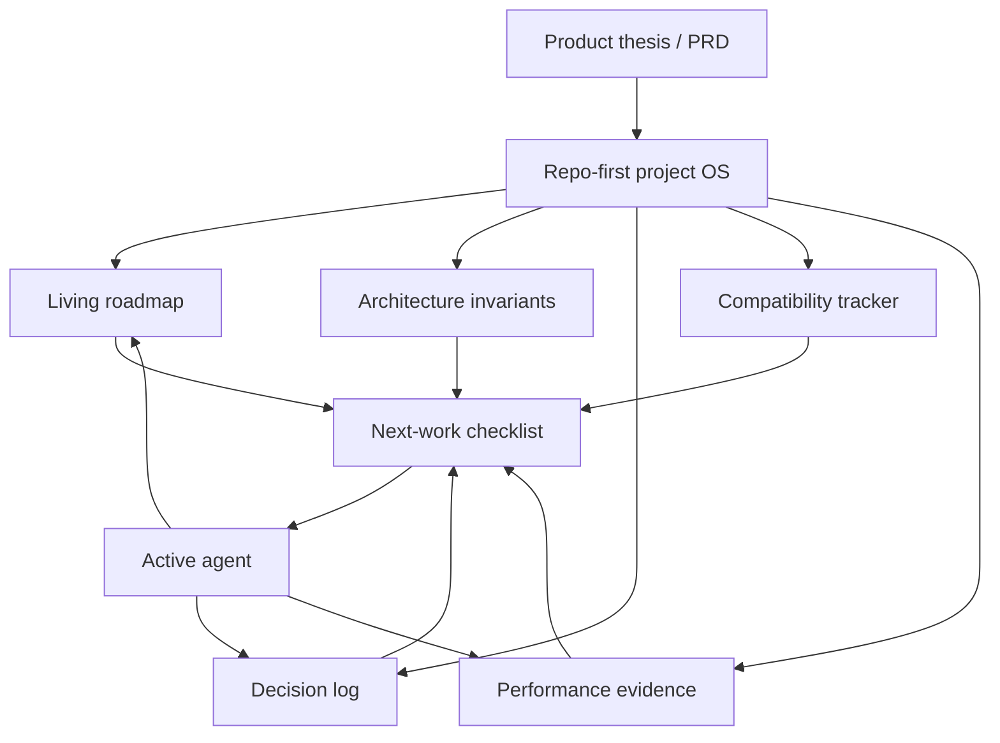

# Project OS for Yach

## Problem Frame

Yach has a clear product thesis: an extremely fast, responsive, minimal, maximally extensible/customizable agentic coding harness in Rust, preserving the best parts of Pi while using Rust for performance and architectural clarity.

The current risk is not that the thesis is unclear; it is that day-to-day work is too loosely selected by whichever agent is active. Without a repo-first planning system, agents can make local progress while losing track of milestone intent, architecture invariants, compatibility targets, benchmark evidence, and open product decisions.

The next phase should establish a lightweight-but-complete project operating system in the repo. Its first version should prioritize templates and structure over a full current-state audit, so future agents know where to put plans, decisions, evidence, and next-work recommendations before more implementation momentum accumulates.

---

## Actors

- A1. Project owner: Sets product direction, decides scope boundaries, and wants confidence that the project is moving toward the right architecture.
- A2. Active implementation agent: Chooses and executes the next task, using repo docs as operating context rather than inventing priorities.
- A3. Planning/review agent: Converts roadmap and open questions into implementation plans, reviews architecture drift, and updates the project OS.
- A4. Future contributor or future-self: Needs to understand current status, intended architecture, and why decisions were made without reconstructing history from commits.

---

## Key Flows

- F1. Choose next work
  - **Trigger:** A new agent session starts or the project owner asks what to work on next.
  - **Actors:** A1, A2
  - **Steps:** Read the project OS index; check roadmap/milestone status; check next-work checklist; review architecture invariants and open decisions relevant to the candidate task; pick or propose the next task.
  - **Outcome:** Work begins from an explicit project priority instead of agent-local intuition.
  - **Covered by:** R1, R2, R3, R8, R9

- F2. Preserve architectural intent
  - **Trigger:** A task touches protocol, adapter, UI, session, compatibility, performance, or future native-backend boundaries.
  - **Actors:** A2, A3
  - **Steps:** Check architecture invariants; identify whether the task changes an invariant or only implements within one; record any material decision or unresolved tradeoff; update the relevant planning artifact.
  - **Outcome:** Architecture evolves deliberately instead of implicitly through code changes.
  - **Covered by:** R4, R5, R6, R10

- F3. Track validation evidence
  - **Trigger:** A compatibility test, benchmark, smoke test, or milestone-relevant check is run.
  - **Actors:** A2, A3, A4
  - **Steps:** Record what was tested, what passed/failed, what evidence changed, and what follow-up work remains.
  - **Outcome:** Progress toward Pi compatibility and performance goals is measured, not hand-waved.
  - **Covered by:** R6, R7, R11

---

## Requirements

**Operating structure**
- R1. The project OS must be repo-first: canonical planning context lives in Markdown under the repository, not only in an agent conversation or external issue tracker.
- R2. The project OS must include an obvious entry point that tells agents which documents to read before choosing work.
- R3. The project OS must include a living roadmap that links the product thesis, current milestone status, next milestone targets, and immediate next-work checklist.
- R4. The project OS must capture architecture invariants that should survive individual implementation choices, especially around minimal core, process boundaries, Yach-owned protocol, Pi compatibility, performance, and extensibility.

**Tracking surfaces**
- R5. The project OS must include a decision log or ADR-style surface for product and architecture decisions that would otherwise be buried in chats or commits.
- R6. The project OS must include compatibility tracking for Pi parity targets, including what is known, unknown, deferred, or blocked.
- R7. The project OS must include performance/benchmark evidence tracking so yach’s responsiveness claims are tied to repeatable observations.
- R8. The project OS must include a next-work checklist that makes the current recommended task sequence explicit and easy to update.

**Agent usability**
- R9. The project OS must include agent handoff rules: what an agent should read before acting, what it should update after work, and how to record uncertainty.
- R10. The project OS must make architecture drift visible by requiring agents to flag when a task changes an invariant, creates a new seam, or expands scope.
- R11. The project OS must distinguish plans, decisions, evidence, and status so agents do not confuse desired architecture with implemented reality.

**First-pass scope**
- R12. The first implementation pass should create templates/skeletons first, not perform a full current-state audit.
- R13. The templates must still be concrete enough to be immediately useful: headings, prompts, and examples should guide future updates rather than leaving blank placeholders everywhere.
- R14. The first pass should preserve existing documents such as `PRD-v0.1.md`, `docs/status/m0-m1-checkpoint.md`, `docs/plans/2026-04-21-m2-tui-alpha-design.md`, and `docs/plans/2026-04-24-tui-ux-backlog.md` by linking or incorporating them instead of replacing them wholesale.

---

## Acceptance Examples

- AE1. **Covers R1, R2, R8, R9.** Given a fresh agent session, when the agent is asked to continue yach work, it can find the project OS entry point, identify the current recommended next work, and state which docs informed that recommendation.
- AE2. **Covers R4, R5, R10.** Given a future task that changes the adapter/protocol boundary, when the task is completed, the agent records whether an existing invariant changed and adds a decision entry if the change is material.
- AE3. **Covers R6, R7, R11.** Given a compatibility or performance claim, when a reader checks the project OS, they can tell whether the claim is implemented, planned, measured, or still an assumption.
- AE4. **Covers R12, R13, R14.** Given the first project OS pass, when a reader opens it, they see a usable skeleton with links to existing project docs, not a large speculative rewrite of all planning content.

---

## Success Criteria

- The project owner no longer feels that next work is chosen loosely by the active agent alone.
- A new agent can orient itself in under a few minutes and propose next work from documented priorities.
- Architecture/product decisions have an obvious place to land before they become implicit code history.
- Compatibility and performance progress can be discussed with evidence and status, not vibes.
- The first pass feels like useful scaffolding rather than bureaucratic overhead.

---

## Scope Boundaries

- Do not implement feature work as part of setting up the project OS.
- Do not require a full audit of the codebase or PRD completion status in the first pass.
- Do not make GitHub issues/projects the first source of truth; they can be derived later if useful.
- Do not replace the existing PRD or current status/plan docs wholesale.
- Do not over-specify native backend architecture before Phase 1 validation creates evidence.
- Do not turn the project OS into a heavyweight process that must be perfectly maintained before implementation can proceed.

---

## Key Decisions

- Reopen product direction enough to optimize architecture/design, but keep the existing yach thesis as the working product shape.
- Use a full project operating system rather than only a roadmap/checklist, because yach will eventually need to track architecture, compatibility, performance, and decisions explicitly.
- Make the project OS repo-first so agents and future contributors share durable context.
- Prioritize templates/skeletons first so structure exists before more implementation work accumulates.

---

## Dependencies / Assumptions

- Existing repo docs remain useful context and should be linked from the new operating system.
- Markdown in the repo is the best initial coordination medium for agent handoffs.
- Future GitHub issue/project integration may be useful, but is not required for the first pass.
- The PRD is a strong hypothesis, not an immutable contract.

---

## Outstanding Questions

### Resolve Before Planning

None.

### Deferred to Planning

- [Affects R2-R8][Technical] What exact document names and directory layout should the project OS use?
- [Affects R5][Product/process] Should decisions be captured as one log file, ADR files, or both?
- [Affects R6][Needs research] What is the most useful first compatibility matrix shape for Pi parity tracking?
- [Affects R7][Needs research] What benchmark evidence format will best support repeatable tail-latency comparison against Pi?
- [Affects R9][Product/process] How strict should the agent read/update checklist be before and after ordinary implementation tasks?

---

## Next Steps

-> /ce-plan for structured implementation planning.
