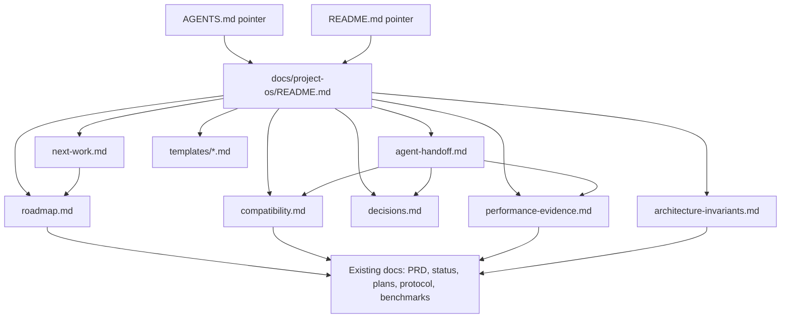

# feat: Add repo-first project OS skeleton

## Overview

Create a repo-first project operating system for yach: an obvious documentation entry point, living roadmap, next-work checklist, architecture invariants, decision log, compatibility tracker, performance evidence tracker, agent handoff rules, and concrete templates. This first pass creates the structure and seeds only source-linked facts from existing docs; it does not perform a full audit or implement product features.

The plan prioritizes discoverability and low-maintenance structure. Agents should be able to orient quickly, choose next work from documented priorities, and know where to record decisions, evidence, and uncertainty.

---

## Problem Frame

Yach’s product thesis is clear, but work selection is currently too dependent on whichever agent is active. The project needs a durable repo-first planning surface so implementation agents preserve milestone intent, architecture invariants, Pi compatibility goals, performance evidence, and open decisions while working toward the PRD. The origin requirements doc defines this as a full project OS with templates/skeletons first, not a full status audit (see origin: `docs/brainstorms/2026-04-26-project-os-requirements.md`).

---

## Requirements Trace

- R1. Planning context must live canonically in repo Markdown.
- R2. There must be an obvious project OS entry point for agents.
- R3. A living roadmap must link thesis, milestone status, next targets, and immediate next work.
- R4. Architecture invariants must be captured and easy to check before boundary-changing work.
- R5. Product and architecture decisions need a durable decision-log surface.
- R6. Pi compatibility targets need explicit status/evidence tracking.
- R7. Performance claims need repeatable evidence tracking.
- R8. A next-work checklist must make the recommended task sequence explicit.
- R9. Agent handoff rules must explain what to read before work and what to update after work.
- R10. Architecture drift must become visible when tasks change invariants, add seams, or expand scope.
- R11. Plans, decisions, evidence, and implemented reality must remain distinct.
- R12. The first implementation pass creates templates/skeletons, not a full audit.
- R13. Skeletons must include concrete prompts/examples rather than blank placeholders.
- R14. Existing docs must be preserved and linked, not replaced wholesale.

**Origin actors:** A1 (project owner), A2 (active implementation agent), A3 (planning/review agent), A4 (future contributor or future-self)

**Origin flows:** F1 (Choose next work), F2 (Preserve architectural intent), F3 (Track validation evidence)

**Origin acceptance examples:** AE1 (fresh agent can find next work), AE2 (boundary changes record invariant/decision impact), AE3 (compatibility/performance claims show status and evidence), AE4 (first pass is usable skeleton, not speculative rewrite)

---

## Scope Boundaries

- Do not implement yach product features as part of this plan.
- Do not perform a full audit of PRD completion or current TUI/runtime status.
- Do not make GitHub issues/projects canonical in this pass.
- Do not replace `PRD-v0.1.md`, existing status docs, plans, benchmark reports, or protocol notes wholesale.
- Do not over-specify the native Rust backend before Phase 1 validation evidence exists.
- Do not create a heavy process that blocks ordinary implementation work unless a task changes priorities, evidence, decisions, or invariants.

### Deferred to Follow-Up Work

- Full PRD/current-state audit: create a later milestone checkpoint once the project OS structure exists.
- GitHub issue/project integration: derive issues from the repo docs later if execution tracking needs it.
- Historical decision extraction: link obvious existing decisions now; extract old decisions into standalone records only when useful.
- README cleanup beyond removing contradictory next-step guidance: replace stale root next-step instructions with a project-OS pointer in this plan, but defer broader README rewriting.

---

## Context & Research

### Relevant Code and Patterns

- `AGENTS.md` currently contains Rust/devenv command guidance only; it is the right place for a minimal agent-facing pointer to the project OS.
- `README.md` is the human-facing entry point and currently contains stale next-step text; a small project-OS pointer improves discoverability without turning this plan into a README rewrite.
- `PRD-v0.1.md` is the main product/architecture source: phase plan, compatibility tiers, performance SLOs, and invariants.
- `docs/status/m0-m1-checkpoint.md` is the best existing pattern for separating implemented reality from planned intent.
- `docs/plans/2026-04-21-m2-tui-alpha-design.md` and `docs/plans/2026-04-24-tui-ux-backlog.md` are current planning/backlog sources to link.
- `docs/protocol/yach-proto-v0.md` models a useful “current contract, not final spec” stance.
- `docs/benchmarks/baseline-2026-04-23.md` is the seed evidence format for performance tracking.

### Institutional Learnings

- No `docs/solutions/` directory exists in this repo.
- Existing docs already encode the strongest conventions: PRD for intent, checkpoint docs for implemented reality, benchmark docs for evidence, protocol notes for current contracts, and plans/backlogs for proposed work.

### External References

- External research was not needed. This is a repo documentation/process structure, and local docs provide direct patterns for the first pass.

---

## Key Technical Decisions

- Create `docs/project-os/` as the canonical project OS directory: keeps the OS discoverable without scattering new surfaces across existing `docs/` areas.
- Start with one `docs/project-os/decisions.md` log, not separate ADR files: lower maintenance burden; the templates can note that large decisions may later become ADR-style files.
- Use shared status vocabulary across roadmap, compatibility, performance, and next-work docs: reduces confusion between `planned`, `in-progress`, `implemented-unverified`, `verified`, `measured`, `unknown`, `blocked`, and `deferred` states.
- Seed current status only from existing docs, with source links and “not re-audited” language: satisfies usefulness without violating the no-full-audit boundary.
- Add minimal pointers in both `AGENTS.md` and `README.md`: `AGENTS.md` guides agents; `README.md` helps humans/future agents avoid stale orientation.
- Treat templates as prompts with examples, not empty forms: directly supports R13 and makes future updates easier.

---

## Open Questions

### Resolved During Planning

- Exact document layout: use `docs/project-os/README.md`, `roadmap.md`, `next-work.md`, `architecture-invariants.md`, `decisions.md`, `compatibility.md`, `performance-evidence.md`, `agent-handoff.md`, and `templates/` files.
- Decision capture format: begin with a single decision log; defer separate ADR files until decisions become large or controversial.
- Compatibility matrix shape: track area, PRD reference, parity tier/category, adapter path, status, evidence link, blocker, and next action.
- Performance evidence format: require date, machine/environment, command or harness, profile, workload, result, comparison target, claim supported, evidence link, and follow-up.
- Agent handoff strictness: mandatory read-before-work guidance for nontrivial tasks; post-work updates only when priorities, status, decisions, evidence, compatibility, performance, or invariants changed.

### Deferred to Implementation

- Exact wording and examples in each template: implementation can tune phrasing while preserving the fields and intent in this plan.
- Whether README needs broader cleanup beyond the stale “Next steps” section: this plan should replace contradictory next-step guidance with a project-OS pointer, but broader README modernization remains follow-up work.
- Whether status vocabulary needs additional values after real use: first pass should prefer the shared baseline and adjust later via decision log if needed.

---

## Output Structure

    docs/project-os/
      README.md
      roadmap.md
      next-work.md
      architecture-invariants.md
      decisions.md
      compatibility.md
      performance-evidence.md
      agent-handoff.md
      templates/
        plan-template.md
        status-checkpoint-template.md
        decision-template.md
        compatibility-entry-template.md
        performance-evidence-template.md
        next-work-item-template.md
        agent-handoff-template.md

---

## High-Level Technical Design

> *This illustrates the intended approach and is directional guidance for review, not implementation specification. The implementing agent should treat it as context, not code to reproduce.*

---

## Implementation Units

- U1. **Create the project OS entry point and shared vocabulary**

**Goal:** Establish `docs/project-os/README.md` as the canonical entry point, with links, reading order, requirement coverage, and shared status vocabulary.

**Requirements:** R1, R2, R11, R13, R14; supports A1-A4, F1-F3, AE1, AE3, AE4

**Dependencies:** None

**Files:**
- Create: `docs/project-os/README.md`

**Approach:**
- Define the project OS purpose in one short section: repo-first coordination for roadmap, architecture, decisions, compatibility, performance, and agent handoff.
- Include a “read this first” order for agents and a default fast path: for ordinary task selection, read the project OS index, `next-work.md`, and `roadmap.md`; consult invariants/decisions/evidence only when the task touches those surfaces; use `AGENTS.md` for command conventions.
- Link existing source docs explicitly: `PRD-v0.1.md`, `docs/status/m0-m1-checkpoint.md`, `docs/plans/2026-04-21-m2-tui-alpha-design.md`, `docs/plans/2026-04-24-tui-ux-backlog.md`, `docs/protocol/yach-proto-v0.md`, `docs/benchmarks/baseline-2026-04-23.md`, and the origin requirements doc.
- Define shared status vocabulary. Suggested baseline: `planned`, `in-progress`, `implemented-unverified`, `verified`, `measured`, `unknown`, `blocked`, `deferred`.
- Add a compact requirement coverage table mapping R1-R14 to the project OS surfaces.
- Label first-pass status as source-linked and not re-audited.

**Patterns to follow:**
- `docs/status/m0-m1-checkpoint.md` for separating status, evidence, gaps, and next step.
- `docs/protocol/yach-proto-v0.md` for “current contract, known omissions” language.

**Test scenarios:**
- Test expectation: none -- docs-only entry-point creation. Verification is by document review and acceptance dry-run rather than automated tests.

**Verification:**
- A reader can start at `docs/project-os/README.md` and find every project OS surface and preserved source doc.
- The README distinguishes planned intent, implemented reality, measured evidence, and unknowns while making the low-ceremony fast path obvious.
- The requirement coverage table accounts for R1-R14 without claiming a full audit was performed.

---

- U2. **Seed roadmap and next-work skeletons with a minimum viable priority queue**

**Goal:** Create living roadmap and next-work docs that are useful immediately while staying within the no-full-audit boundary, including a small source-linked priority queue agents can act from.

**Requirements:** R3, R8, R11, R12, R13, R14; supports F1, AE1, AE4

**Dependencies:** U1

**Files:**
- Create: `docs/project-os/roadmap.md`
- Create: `docs/project-os/next-work.md`

**Approach:**
- In `roadmap.md`, summarize the PRD milestone ladder M0-M5 and seed only source-linked status from existing docs.
- Mark M0/M1 as complete only by reference to `docs/status/m0-m1-checkpoint.md`.
- Mark M2 as active/needs current checkpoint rather than trying to audit implementation in this pass.
- Keep later milestones as planned/deferred per `PRD-v0.1.md`.
- In `next-work.md`, include a short prioritized checklist with fields such as status, priority owner/source, why next, source freshness, done when, and notes/blockers.
- Separate owner-approved/current work from agent-proposed candidate work so the last active agent does not silently become the product owner.
- Seed 3-5 minimum viable next-work items from existing docs only, with explicit provenance. The top item should be a current M2/TUI status checkpoint after the project OS skeleton exists; this is not a full PRD/current-state audit.
- Include staleness metadata: last updated date, source docs, source date/freshness warning, and optional claimed-by/session field.

**Patterns to follow:**
- `PRD-v0.1.md` section 12 for milestone names and gates.
- `docs/status/m0-m1-checkpoint.md` for current M0/M1 status and suggested next step.
- `docs/plans/2026-04-24-tui-ux-backlog.md` for grouped backlog style.

**Test scenarios:**
- Test expectation: none -- docs-only roadmap/checklist creation.

**Verification:**
- Covers AE1: a fresh agent can identify 3-5 current or candidate next-work items and cite which docs support them.
- Roadmap entries do not imply a full audit; seeded facts point to existing docs and carry freshness/provenance labels.
- Next-work items include enough fields for future agents to update status without inventing a format, while distinguishing committed priorities from agent proposals.

---

- U3. **Capture architecture invariants and decision log**

**Goal:** Give agents a place to check durable architectural rules before making changes and a place to record product/architecture decisions.

**Requirements:** R4, R5, R10, R11, R13, R14; supports F2, AE2

**Dependencies:** U1

**Files:**
- Create: `docs/project-os/architecture-invariants.md`
- Create: `docs/project-os/decisions.md`

**Approach:**
- In `architecture-invariants.md`, seed invariants from `PRD-v0.1.md` and current docs: UI does not speak Pi RPC directly; `yach-proto` is the UI/adapter seam; process boundaries are intentional; minimal core/maximal customization; file-first compatibility; compatibility measured not assumed; performance claims require evidence; Phase 2 follows Phase 1 validation.
- For each invariant, include rationale, source, current status, what would violate it, and what to do if it must change.
- Define invariant-change protocol: add/update a decision entry, link impacted roadmap/compatibility/performance docs, and flag scope expansion.
- In `decisions.md`, use stable decision IDs or dated entries with fields for status, context, decision, rationale, consequences, related docs, and follow-up.
- Seed only obvious existing decisions by linking source docs; do not extract the full historical record.

**Patterns to follow:**
- `PRD-v0.1.md` architecture and product principles.
- `docs/protocol/yach-proto-v0.md` for current-contract language.
- `docs/plans/2026-04-21-m2-tui-alpha-design.md` for embedded key decisions that can be linked as prior art.

**Test scenarios:**
- Test expectation: none -- docs-only invariant and decision-log creation.

**Verification:**
- Covers AE2: a future protocol/adapter boundary change has a clear instruction to record invariant impact and material decisions.
- Each invariant distinguishes source intent from current implementation/evidence when applicable.
- `decisions.md` is lightweight enough to update during ordinary agent work.

---

- U4. **Create compatibility and performance evidence trackers**

**Goal:** Make Pi parity and performance claims trackable by status and evidence instead of aspiration.

**Requirements:** R6, R7, R11, R13, R14; supports F3, AE3

**Dependencies:** U1

**Files:**
- Create: `docs/project-os/compatibility.md`
- Create: `docs/project-os/performance-evidence.md`

**Approach:**
- In `compatibility.md`, define a matrix shape with fields: area, PRD reference, category/tier, adapter path, implementation status, evidence status/link, blocker/unknown, confidence/notes, and next action.
- Seed categories from `PRD-v0.1.md`: resource/settings/package compatibility, session compatibility, Tier A stock RPC parity, Tier B rich UI/SDK parity, canonical compatibility suites.
- Use statuses from U1 and avoid claiming green parity without evidence links.
- In `performance-evidence.md`, create an evidence index that links detailed reports instead of replacing them.
- Require evidence metadata: date, machine/environment, command or harness, profile/build mode, workload, result, comparison target, claim supported, artifact/link, confidence/limitations, and follow-up.
- Link `docs/benchmarks/baseline-2026-04-23.md` as existing baseline evidence and note which PRD SLOs still need evidence without trying to measure them now.

**Patterns to follow:**
- `PRD-v0.1.md` sections 6, 10, 11, 13 for compatibility/performance targets.
- `docs/status/m0-m1-checkpoint.md` Tier A compatibility snapshot.
- `docs/benchmarks/baseline-2026-04-23.md` benchmark evidence format.

**Test scenarios:**
- Test expectation: none -- docs-only tracker creation.

**Verification:**
- Covers AE3: a reader can tell whether a compatibility/performance claim is planned, implemented, verified/measured, unknown, blocked, or deferred, and can separately see implementation state versus evidence state where those differ.
- Trackers contain evidence-link fields and do not present PRD goals as measured reality.
- Existing benchmark/status docs are linked rather than duplicated wholesale.

---

- U5. **Add agent handoff rules and templates**

**Goal:** Define how agents use and maintain the project OS, including partial/failure states and concrete template prompts.

**Requirements:** R9, R10, R11, R13; supports A2-A4, F1-F3, AE1-AE4

**Dependencies:** U1, U2, U3, U4

**Files:**
- Create: `docs/project-os/agent-handoff.md`
- Create: `docs/project-os/templates/plan-template.md`
- Create: `docs/project-os/templates/status-checkpoint-template.md`
- Create: `docs/project-os/templates/decision-template.md`
- Create: `docs/project-os/templates/compatibility-entry-template.md`
- Create: `docs/project-os/templates/performance-evidence-template.md`
- Create: `docs/project-os/templates/next-work-item-template.md`
- Create: `docs/project-os/templates/agent-handoff-template.md`

**Approach:**
- In `agent-handoff.md`, define before-work, during-work, and after-work checklists.
- Before-work should define a fast path for ordinary task selection (`README.md`/index, `next-work.md`, `roadmap.md`) and a deeper path for tasks that touch architecture, compatibility, performance, or decisions; `AGENTS.md` remains the command-convention source.
- During-work should require agents to flag invariant changes, new seams, scope expansion, uncertainty, and claims requiring evidence.
- Add an explicit after-work update gate with yes/no prompts: Did priority/status change? Did a product or architecture decision get made? Did compatibility or performance evidence change? Did the task touch an invariant, boundary, or new seam? Did any uncertainty/blocker remain?
- After-work should require updates only when the gate says yes: roadmap/next-work for priority/status changes, decisions for material choices, compatibility for parity evidence, performance evidence for benchmark results, status docs for checkpoint-level progress.
- Include partial/failure handoff fields: attempted work, files changed, checks run, evidence added, decisions made, invariants touched, blockers, and why project OS docs were or were not updated.
- Templates should include short instructions, required fields, optional fields, and a small clearly illustrative or source-linked example; avoid generic placeholder-only sections.

**Patterns to follow:**
- `AGENTS.md` for keeping agent instructions concise.
- `docs/status/m0-m1-checkpoint.md` and `docs/benchmarks/baseline-2026-04-23.md` for status/evidence template sections.

**Test scenarios:**
- Test expectation: none -- docs-only handoff/template creation.

**Verification:**
- A future agent can copy a template and know what information belongs in it without asking for format guidance.
- The handoff rules do not require project OS updates after every trivial task, but do require updates when decisions, evidence, status, or invariants change.
- Partial/failure states have an explicit place to be recorded.

---

- U6. **Make the project OS discoverable from existing entry points**

**Goal:** Ensure humans and agents can find the new project OS from the repo’s existing orientation files.

**Requirements:** R1, R2, R9, R14; supports F1, AE1

**Dependencies:** U1, U2, U3, U4, U5

**Files:**
- Modify: `AGENTS.md`
- Modify: `README.md`

**Approach:**
- Add a small `Project OS` section to `AGENTS.md` that points agents to `docs/project-os/README.md` before choosing implementation work and summarizes when to update project OS docs.
- Preserve existing Rust/devenv command guidance exactly; do not duplicate command recipes in the project OS docs.
- Replace the stale root `README.md` “Next steps” section with a short pointer to the project OS entry point and `docs/project-os/next-work.md`; move any still-relevant items into the project OS as follow-up candidates rather than leaving contradictory guidance in place.
- Avoid broad README cleanup beyond removing this direct contradiction.

**Patterns to follow:**
- Current `AGENTS.md` style: short headings and actionable bullets.
- Current `README.md` workspace overview style.

**Test scenarios:**
- Test expectation: none -- docs-only discoverability update.

**Verification:**
- Starting from `AGENTS.md`, an agent can find `docs/project-os/README.md` before choosing work.
- Starting from `README.md`, a human can find where roadmap, milestone status via linked status docs, and next work live, without encountering contradictory root next-step instructions.
- Existing command/environment guidance remains intact.

---

## System-Wide Impact

- **Interaction graph:** This plan affects documentation and agent workflow only. It does not change Rust crates, runtime behavior, protocol semantics, or CLI commands.
- **Error propagation:** Not applicable to runtime behavior. Documentation failure modes are stale status, overclaiming evidence, and undiscoverable entry points.
- **State lifecycle risks:** Repo-first docs can drift. Mitigation is a short agent handoff checklist, explicit after-work update gate, priority owner/source fields, and staleness metadata in next-work/roadmap surfaces.
- **API surface parity:** No public API or CLI surface changes. The compatibility tracker should reference protocol/adapter areas without modifying them.
- **Integration coverage:** Acceptance is primarily by dry-run review: can a fresh agent choose next work, preserve invariants, and distinguish evidence from intent?
- **Unchanged invariants:** Existing PRD architecture remains the product hypothesis. This plan operationalizes it; it does not redefine yach’s product direction or native backend design.

---

## Risks & Dependencies

| Risk | Mitigation |
|------|------------|
| Project OS becomes too heavy and agents ignore it | Keep first pass repo-first, short, and template-driven; require updates only when status, evidence, decisions, priorities, or invariants change. |
| Skeletons are too empty to be useful | Include concrete fields, examples, shared statuses, and source links in every template/surface. |
| Docs accidentally claim current-state facts without audit | Seed only from existing docs and label status as source-linked/not re-audited. |
| Fresh agents miss the project OS or follow stale root guidance | Add pointers in both `AGENTS.md` and `README.md`, and replace the stale root `README.md` next-step section with a project-OS pointer. |
| Compatibility/performance trackers duplicate source docs and drift | Make trackers indexes with separate implementation/evidence fields and links, not replacements for detailed benchmark/status reports. |
| Decision log becomes a dumping ground | Use lightweight fields and stable IDs; reserve separate ADR-style files for later only if decisions need more depth. |

---

## Documentation / Operational Notes

- This is itself a documentation/process plan; implementation should be limited to Markdown docs plus minimal entry-point pointers.
- After implementation, the next useful planning task is likely a current M2 status checkpoint using the new project OS structure.
- Closing this plan should include a dry-run acceptance exercise: from `AGENTS.md`/`README.md` plus `docs/project-os/README.md`, identify the recommended next work, cite the source docs, and note friction.
- If the implementing agent discovers substantial stale README content beyond the contradictory next-step section, it should record a follow-up next-work item rather than broadening this plan.

---

## Sources & References

- **Origin document:** [docs/brainstorms/2026-04-26-project-os-requirements.md](../brainstorms/2026-04-26-project-os-requirements.md)
- Product thesis and milestones: [PRD-v0.1.md](../../PRD-v0.1.md)
- Existing checkpoint pattern: [docs/status/m0-m1-checkpoint.md](../status/m0-m1-checkpoint.md)
- Existing TUI plan: [docs/plans/2026-04-21-m2-tui-alpha-design.md](2026-04-21-m2-tui-alpha-design.md)
- Existing UX backlog: [docs/plans/2026-04-24-tui-ux-backlog.md](2026-04-24-tui-ux-backlog.md)
- Protocol note: [docs/protocol/yach-proto-v0.md](../protocol/yach-proto-v0.md)
- Benchmark baseline: [docs/benchmarks/baseline-2026-04-23.md](../benchmarks/baseline-2026-04-23.md)
- Agent/tooling guidance: [AGENTS.md](../../AGENTS.md)
