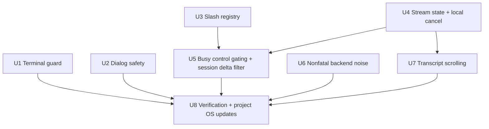
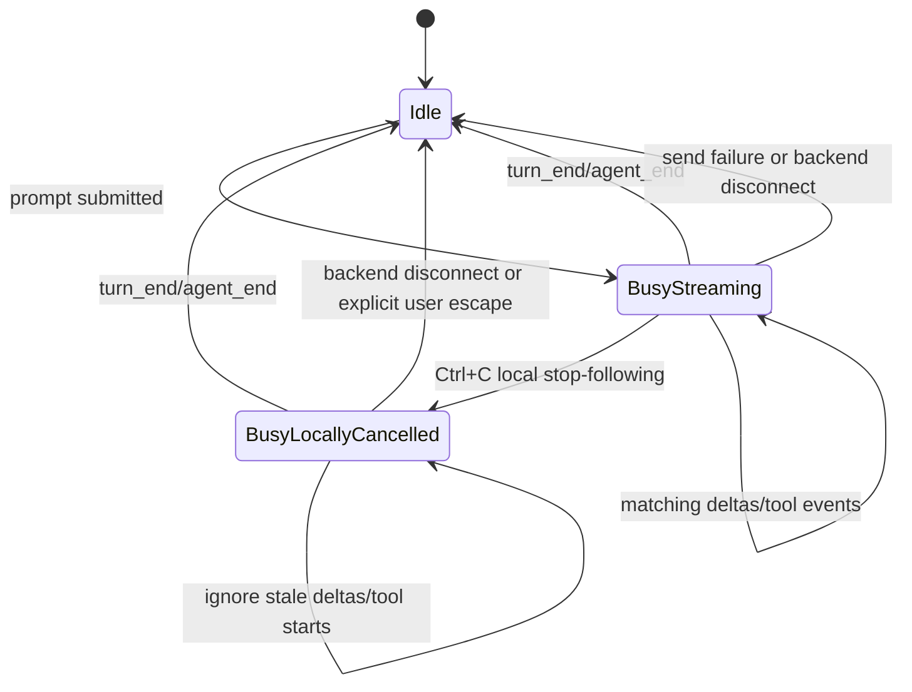

# feat: Harden M2 TUI alpha

## Overview

Harden the existing M2 TUI alpha so it is safer to dogfood and can move from `implemented-unverified / partial` toward a verified alpha. The pass focuses on terminal lifecycle safety, stream/cancel semantics, session/model/thinking safety while streaming, dialog robustness, slash command correctness, minimal transcript scrolling, and nonfatal handling of benign backend noise.

This plan deliberately does not expand into M3 compatibility work, dynamic model/session discovery, full transcript virtualization, or performance SLO measurement. It closes the highest-risk alpha gaps identified in `docs/status/m2-tui-checkpoint.md`.

---

## Problem Frame

The core TUI exists, compiles, and has useful unit coverage, but the current checkpoint identifies several alpha blockers: terminal cleanup is not guaranteed after runtime errors, Ctrl+C implies cancellation without backend cancellation support, controls can mutate session/model/thinking state during active streams, dialog editing is unsafe for Unicode, slash command completion and execution drift, transcript scrolling is absent, and unknown backend events can be brittle.

A focused hardening pass should make the current TUI safe enough for broader manual dogfooding without pretending M2 or Phase 1 compatibility is complete.

---

## Requirements Trace

- R1. Restore terminal raw mode, alternate screen, and cursor visibility on normal exit and error paths.
- R2. Define honest M2-alpha cancellation semantics without inventing unsupported Pi backend cancellation.
- R3. Prevent stale backend deltas from reviving a locally cancelled stream.
- R4. Prevent model/session/thinking/fork changes from corrupting active stream/session state.
- R5. Filter prompt deltas by active stream/session when enough session context exists.
- R6. Make dialog text/editor input safe for multibyte Unicode.
- R7. Preserve dialog request ordering instead of overwriting an active dialog.
- R8. Make slash command completion/help/execution use one registry and exact command matching.
- R9. Add minimal transcript scrolling that does not conflict with prompt textarea cursor movement.
- R10. Treat unknown/noncritical Pi RPC events as bounded nonfatal status/debug noise where possible.
- R11. Preserve the yach architecture invariant that UI talks through `yach-proto`, not Pi RPC directly.
- R12. Add focused unit/parser tests and a manual alpha smoke checklist for the hardened behaviors.

---

## Scope Boundaries

- Do not implement full backend/tool cancellation unless a documented Pi RPC cancellation command is confirmed during implementation.
- Do not add dynamic model discovery or full persisted session browsing; those remain later M2/M3 work.
- Do not implement full transcript virtualization or large-session performance optimization in this pass.
- Do not expand into settings/resources/package compatibility, existing Pi session-file compatibility, or rich SDK sidecar parity.
- Do not introduce direct Pi RPC knowledge into `yach-ui`.
- Do not make performance claims beyond what this pass actually measures or verifies.

### Deferred to Follow-Up Work

- Startup/init timeout and visible startup progress.
- Bounded Pi child stderr display/logging.
- Full transcript/tool virtualization and backpressure.
- Dynamic model/session source and backend-confirmed selector rollback.
- PRD SLO measurements: startup, keypress-to-paint p95/p99, heavy tool output, large transcript, Pi comparison.
- Rich dialog scrolling/cursor rendering polish beyond safety and FIFO behavior.

---

## Context & Research

### Relevant Code and Patterns

- `crates/yach-ui/src/app.rs` owns TUI state, keyboard handling, dialogs, selectors, stream state, and `run_tui` terminal lifecycle.
- `crates/yach-ui/src/transcript.rs` owns transcript entries, wrapping, and rendering; current scroll offset semantics are not aligned with rendered visual lines.
- `crates/yach-ui/src/slash_commands.rs` contains a partial static command list; `crates/yach-ui/src/app.rs` currently executes additional commands with prefix matching.
- `crates/yach-ui/src/input.rs` shows the preferred `ratatui-textarea` direction for safe composer editing.
- `crates/yach-proto/src/lib.rs` includes `PromptDelta { session_id, delta }` but no cancellation event.
- `crates/yach-adapter-pi-rpc/src/parse.rs` currently rejects unknown methods, and `crates/yach-cli/src/main.rs` bridge handling can convert parse errors into backend disconnects.
- Existing tests are mostly inline unit tests inside implementation modules and avoid `unwrap`/`expect` due workspace Clippy policy.

### Institutional Learnings

- `docs/status/m2-tui-checkpoint.md` supersedes the older M2 design where they disagree; M2 is partial, and terminal cleanup/scrolling are not complete.
- `docs/project-os/architecture-invariants.md` requires preserving the `yach-proto` seam and keeping compatibility/performance claims evidence-linked.
- `docs/project-os/performance-evidence.md` shows that existing benchmarks prove protocol internals, not full TUI responsiveness.

### External References

- External research was not needed. The plan is grounded in current repo code, checkpoint findings, and existing Rust/TUI patterns already present in the codebase.

---

## Key Technical Decisions

- Treat Ctrl+C during streaming as M2-alpha **local stop-following**, not true backend cancellation, unless implementation confirms a stock Pi RPC cancellation command.
- Represent backend busy/streaming/cancelled state explicitly instead of relying only on `is_streaming: bool`; `backend_busy()` includes both `Streaming` and `LocallyCancelled` until lifecycle end, backend disconnect, send failure, or an explicit user escape path.
- Disable model/session/thinking/fork controls while backend work is busy for this alpha pass; backend-originated state changes during busy state must be deferred or handled without corrupting the active stream display.
- Use exact slash command token matching. Prefixes such as `/clearance` or `/quit-now` must not execute destructive commands, and unsupported arguments to no-argument commands must be rejected with a status message.
- Use `PageUp`, `PageDown`, and `End` for transcript scrolling in this pass so Up/Down remain available to the prompt textarea.
- Keep unknown well-formed, clearly noncritical backend events nonfatal when safely ignored or surfaced as status; unknown lifecycle/tool/dialog/session-looking events should be nonfatal but visibly degraded/incompatible rather than silently ignored; malformed JSON or structurally invalid core events may remain fatal if recovery is unsafe.

---

## Open Questions

### Resolved During Planning

- Ctrl+C semantics: M2 alpha should not claim real backend cancellation unless documented support is found; default to local stop-following plus busy-state gating. If lifecycle end never arrives, a second Ctrl+C or explicit quit path must let the user escape rather than wedge the UI forever.
- Controls during streaming/local cancellation: block model/session/thinking/fork while backend is busy, where busy includes both active streaming and locally cancelled turns waiting for backend completion.
- Transcript scroll keys: use PageUp/PageDown/End initially to avoid focus-model work.
- Slash arguments: exact command tokens only in this pass. Commands in this plan are no-argument commands; extra non-whitespace text such as `/clear now` or `/model gpt-5` should be rejected with a clear status rather than partially executed.
- Dialog concurrency: queue dialogs FIFO rather than overwriting the active dialog, with bounded queue depth, duplicate-id handling, missing-id policy, and disconnect cleanup.

### Deferred to Implementation

- Whether stock Pi exposes a documented cancellation command: if found, implementation may add a real cancel path through `yach-proto` and adapter serialization; otherwise keep local semantics.
- Exact source of stock RPC stream/session identity: implementation must account for adapter-synthesized session ids such as `"active"` so normal stock Pi deltas are not filtered out accidentally.
- Exact terminal guard testability: use unit-testable helper state where possible; add an injectable post-setup error path or command-recorder-style test for runtime cleanup, plus a manual smoke checklist for real terminal restoration.

---

## High-Level Technical Design

> *This illustrates the intended approach and is directional guidance for review, not implementation specification. The implementing agent should treat it as context, not code to reproduce.*

Expected stream policy:

---

## Implementation Units

- U1. **Add terminal lifecycle guard**

**Goal:** Ensure terminal raw mode, alternate screen, and cursor visibility are restored on normal exit and after setup/render/runtime errors.

**Requirements:** R1, R12

**Dependencies:** None

**Files:**
- Modify: `crates/yach-ui/src/app.rs`
- Test: `crates/yach-ui/src/app.rs`

**Approach:**
- Introduce a small terminal cleanup guard around `run_tui` setup.
- Track which setup steps succeeded: raw mode enabled, alternate screen entered, cursor hidden.
- On normal exit, explicitly restore and surface cleanup errors where practical.
- On early return/error, use `Drop` for best-effort cleanup without `unwrap`/`expect`.
- Restore cursor visibility with `Show`, not only `LeaveAlternateScreen`.
- Keep the guard local to `yach-ui`; do not change CLI command behavior beyond safer cleanup.
- Add an injectable post-setup render/runtime error path or command-recorder-style helper test so cleanup after loop failure is tested, not only setup failure.

**Patterns to follow:**
- Current `run_tui` setup/cleanup in `crates/yach-ui/src/app.rs`.
- Existing test style in `crates/yach-ui/src/app.rs` for small state helpers.

**Test scenarios:**
- Happy path: guard records setup steps and restores them in reverse/best-effort order.
- Error path: if setup fails after raw mode, restore disables raw mode.
- Error path: if setup fails after alternate screen/cursor hide, restore leaves screen and shows cursor.
- Error path: post-setup render/runtime error returns through the guard and records/simulates cleanup.
- Integration/manual: launch `yach-cli tui`, quit immediately, and verify shell echo/cursor/line discipline are normal.

**Verification:**
- `run_tui` no longer has unguarded terminal state after partial setup or post-setup runtime/draw errors.
- Manual smoke checklist includes terminal restoration after normal quit.

---

- U2. **Make dialog input safe and queue dialog requests**

**Goal:** Prevent Unicode cursor panics and preserve dialog ordering when multiple backend dialogs arrive.

**Requirements:** R6, R7, R12

**Dependencies:** None

**Files:**
- Modify: `crates/yach-ui/src/app.rs`
- Test: `crates/yach-ui/src/app.rs`

**Approach:**
- Prefer reusing `ratatui-textarea` for dialog input/editor if it is smaller and compatible with dialog submit/cancel semantics; otherwise keep the current dialog buffer and make it char-boundary-safe.
- Normalize `cursor_pos` to char boundaries before mutations.
- Insert characters by `c.len_utf8()`, not by one byte.
- Backspace/delete by draining full char ranges from previous/current to next boundary.
- Reuse existing helpers such as `prev_char_boundary`, `next_char_boundary`, and `byte_boundary_at_or_before`, adjusting them if tests expose gaps.
- Add a FIFO pending-dialog queue so a second `DialogRequested` does not overwrite the active dialog.
- Bound the queue depth and surface a status/error if the backend exceeds it.
- Handle duplicate dialog ids deliberately: update/replace the queued dialog with that id or reject the duplicate, but do not create ambiguous duplicate responses.
- On dialog resolve/cancel, pop the next queued dialog and enter the correct dialog mode.
- Treat missing dialog ids deliberately: avoid silently sending an empty id for response-required dialogs; surface a status/error or keep the current behavior only if tests document the compatibility reason.
- Clear active and queued dialogs on backend disconnect.

**Patterns to follow:**
- Main prompt uses `ratatui-textarea` for robust editing in `crates/yach-ui/src/input.rs`.
- Existing dialog resolution tests in `crates/yach-ui/src/app.rs`.

**Test scenarios:**
- Happy path: input dialog accepts `éa` and submits exact text.
- Edge case: emoji Backspace removes the whole emoji without panic.
- Edge case: Delete removes a full multibyte character at the cursor.
- Edge case: Left/Right movement remains on char boundaries for CJK/emoji text.
- Integration: dialog A remains active when dialog B arrives; resolving A opens B next.
- Edge case: duplicate dialog ids do not create ambiguous duplicate queued responses.
- Edge case: queue depth is bounded and overflow is visible.
- Error path: backend disconnect clears active and queued dialogs.

**Verification:**
- Dialog text/editor operations do not panic with multibyte input.
- Multiple dialogs are serialized FIFO.

---

- U3. **Unify slash command registry and exact parsing**

**Goal:** Make completion, help, and execution agree, and prevent accidental destructive prefix matches.

**Requirements:** R8, R12

**Dependencies:** None

**Files:**
- Modify: `crates/yach-ui/src/slash_commands.rs`
- Modify: `crates/yach-ui/src/app.rs`
- Test: `crates/yach-ui/src/slash_commands.rs`
- Test: `crates/yach-ui/src/app.rs`

**Approach:**
- Retain `/exit` as an exact alias for `/quit` unless implementation finds a compelling compatibility reason to remove it.
- Add all executable commands to the registry: `/quit`, `/exit`, `/clear`, `/model`, `/session`, `/fork`, `/thinking`, `/perf`, `/help`.
- Expose a parser that extracts the first whitespace-delimited token and matches exact commands/aliases.
- Drive help text and completion from the same registry so future commands do not drift.
- Require exact token matches for `/quit`, `/exit`, and `/clear`.
- Reject extra non-whitespace arguments for every command in this pass with a clear status message, rather than executing partial prefix behavior.

**Patterns to follow:**
- Current command registry in `crates/yach-ui/src/slash_commands.rs`.
- Current slash submit handler in `crates/yach-ui/src/app.rs`.

**Test scenarios:**
- Happy path: `/clear` clears transcript.
- Edge case: `/clearance` does not clear transcript and produces normal unknown-command/status behavior.
- Edge case: `/quit-now` does not quit.
- Happy path: `/thinking`, `/fork`, and `/perf` are present in completion and executable.
- Edge case: leading/trailing whitespace around exact commands behaves consistently.
- Edge case: `/clear now`, `/quit now`, and `/model gpt-5` do not execute partial behavior.
- Integration: `/help` lists the same executable commands as completion.

**Verification:**
- There is one command registry source for completion/help/execution.
- Prefix-only destructive command bugs are closed.

---

- U4. **Introduce explicit stream state and local cancel semantics**

**Goal:** Replace ambiguous `is_streaming`-only behavior with explicit busy/streaming/cancelled state and honest Ctrl+C behavior.

**Requirements:** R2, R3, R11, R12

**Dependencies:** U3 optional but recommended before slash-control gating; no hard code dependency.

**Files:**
- Modify: `crates/yach-ui/src/app.rs`
- Test: `crates/yach-ui/src/app.rs`
- Modify: `crates/yach-proto/src/lib.rs` only if a documented real cancel event is confirmed
- Modify: `crates/yach-adapter-pi-rpc/src/serialize.rs` only if a documented real cancel event is confirmed

**Approach:**
- Add a small stream-state model, such as `Idle`, `Streaming { session_id }`, and `LocallyCancelled { session_id }`.
- Keep render-facing `is_streaming` behavior derived from stream state or update call sites consistently.
- On prompt submit, enter `Streaming` for the current session and append the user message.
- On Ctrl+C while streaming, enter `LocallyCancelled`, clear active tools, and set honest status such as `cancelled locally; waiting for backend to finish`.
- While locally cancelled, ignore prompt deltas and tool starts/updates that would visually revive the cancelled turn.
- On `turn_end`/`agent_end` lifecycle status, return to `Idle` and clear active tools/cancel flags.
- On backend disconnect or prompt-send failure, clear busy/cancel state so the UI is not permanently gated.
- Provide an explicit user escape path for a locally cancelled turn whose backend never emits lifecycle end, such as second Ctrl+C quitting or force-idling with a clear status.
- Do not add a fake backend cancel command. If implementation discovers a documented Pi cancel command, add it through `ClientEvent` and adapter serialization with tests.

**Patterns to follow:**
- Existing lifecycle status filtering in `crates/yach-ui/src/app.rs`.
- `yach-proto` event additions only when crossing UI/adapter boundaries is necessary.

**Test scenarios:**
- Happy path: prompt submit enters streaming state and matching deltas append.
- Happy path: lifecycle end clears streaming state.
- Edge case: Ctrl+C during streaming marks local cancellation but does not quit.
- Edge case: prompt delta after local cancellation is ignored and does not set streaming true.
- Edge case: tool start after local cancellation does not re-add active tool UI.
- Edge case: new prompt after backend end starts a fresh stream normally.
- Error path: prompt send failure leaves stream state idle/disconnected rather than busy.
- Error path: backend disconnect while streaming or locally cancelled clears busy state.
- Escape path: second Ctrl+C or chosen escape action prevents indefinite locally-cancelled busy state.

**Verification:**
- Ctrl+C behavior no longer implies unsupported backend cancellation.
- Stale deltas cannot visually revive a cancelled stream.

---

- U5. **Gate controls while backend is busy and filter session deltas**

**Goal:** Prevent model/session/thinking/fork changes and cross-session deltas from corrupting active stream state.

**Requirements:** R4, R5, R11, R12

**Dependencies:** U3, U4

**Files:**
- Modify: `crates/yach-ui/src/app.rs`
- Test: `crates/yach-ui/src/app.rs`

**Approach:**
- Add a helper such as `backend_busy()` / `stream_blocks_controls()` based on explicit stream state; it must return true for both `Streaming` and `LocallyCancelled` until lifecycle end, disconnect, send failure, or explicit escape.
- Gate keyboard shortcuts Ctrl+M, Ctrl+S, Ctrl+T, and Ctrl+F while busy.
- Gate slash commands `/model`, `/session`, `/thinking`, and `/fork` while busy.
- Add defensive checks in selector confirmation handlers so controls cannot apply if state changes while a selector is open.
- Show a clear status message when blocked, e.g. `wait for current response before changing session/model/thinking`.
- Handle backend-originated `StateUpdated`, `SessionChanged`, and `ModelChanged` while busy deliberately: defer display changes until idle, apply only if correlated to the active stream, or mark pending without changing the active stream identity.
- Use `PromptDelta.session_id` carefully: account for stock RPC adapter placeholder/effective session ids such as `"active"` so normal deltas are not dropped; ignore only deltas that are clearly for a different active session/stream.
- Document in code/tests that tool events are not fully session-correlated yet because current protocol events lack session ids.

**Patterns to follow:**
- Existing capability-gated session fork behavior in `crates/yach-ui/src/app.rs`.
- `ServerEvent::PromptDelta { session_id, delta }` in `crates/yach-proto/src/lib.rs`.

**Test scenarios:**
- Happy path: controls open normally when idle.
- Edge case: Ctrl+M/Ctrl+S/Ctrl+T/Ctrl+F are blocked while streaming and while locally cancelled.
- Edge case: `/model`, `/session`, `/thinking`, `/fork` are blocked while streaming and while locally cancelled.
- Edge case: selector Enter is blocked if backend becomes busy while selector is open.
- Edge case: backend `SessionChanged`/`StateUpdated` during busy state does not corrupt the active stream display.
- Edge case: prompt delta for clearly non-active session is ignored.
- Happy path: stock RPC placeholder/effective session id deltas for the active stream are appended.

**Verification:**
- Active stream state cannot be mixed with a new model/session/thinking selection.
- Cross-session prompt deltas do not enter the visible transcript for the active stream.

---

- U6. **Handle unknown backend events as bounded nonfatal noise**

**Goal:** Make the TUI more robust to benign Pi RPC event additions without weakening core parse errors.

**Requirements:** R10, R11, R12

**Dependencies:** None

**Files:**
- Modify: `crates/yach-adapter-pi-rpc/src/parse.rs`
- Modify: `crates/yach-cli/src/main.rs`
- Test: `crates/yach-adapter-pi-rpc/src/parse.rs`
- Test: `crates/yach-cli/src/main.rs`

**Approach:**
- Prefer handling unknown-method tolerance in the CLI bridge or a small adapter helper so generic parser semantics for other consumers do not silently change more than needed; if parser semantics change, update adapter tests explicitly.
- If bridge tests need it, make `bridge_reader_loop` generic over `Read` rather than hard-typed to `ChildStdout` so unit tests can feed synthetic lines.
- Apply this policy:

  | Event class | Example | Output | Fatal? | Bound |
  |---|---|---|---|---|
  | Known valid event | prompt delta, status, tool, dialog | Typed `ServerEvent` | No | Normal handling |
  | Unknown clearly noncritical event | unknown cosmetic/widget-like method | `StatusUpdated`/debug-style ignored notice | No | Coalesce/reuse one status per method class |
  | Unknown lifecycle/tool/dialog/session-looking event | unknown `turn_*`, `dialog_*`, `tool_*`, `session_*` shape | Degraded/incompatible status that remains visible | No by default, but do not silently ignore | Bound repeated reports |
  | Malformed JSON/framing | invalid JSON line | Reader error/disconnect or explicit fatal status | Yes unless recovery is proven safe | N/A |
  | Known core event missing required fields | prompt delta missing text/session context | Error or fatal status according to existing parser contract | Usually yes | N/A |

- Preserve adapter boundary: do not expose raw Pi RPC shapes to `yach-ui`.
- Update tests that currently expect unknown methods to reject if policy changes.

**Patterns to follow:**
- Existing parse tests in `crates/yach-adapter-pi-rpc/src/parse.rs`.
- Bridge reader loop in `crates/yach-cli/src/main.rs`.

**Test scenarios:**
- Happy path: known events still parse into typed server events.
- Edge case: unknown clearly noncritical well-formed event does not disconnect the TUI bridge.
- Edge case: unknown lifecycle-like event during streaming/cancelled state produces degraded/incompatible status and does not silently leave the state machine wedged.
- Error path: malformed JSON remains a fatal parse/read error unless implementation documents a safe recovery path.
- Edge case: repeated unknown events are bounded or coalesced.
- Integration: bridge turns nonfatal unknown event handling into a status/debug event rather than `BackendEvent::Disconnected`.

**Verification:**
- Unknown benign backend events no longer kill the TUI.
- Core parse failures still surface clearly.

---

- U7. **Add minimal transcript scrolling**

**Goal:** Let users review previous transcript output without stealing normal prompt editing keys or building full virtualization.

**Requirements:** R9, R12

**Dependencies:** U4 recommended for auto-follow semantics

**Files:**
- Modify: `crates/yach-ui/src/app.rs`
- Modify: `crates/yach-ui/src/transcript.rs`
- Modify: `crates/yach-ui/src/layout.rs` if render parameters need adjustment
- Test: `crates/yach-ui/src/app.rs`
- Test: `crates/yach-ui/src/transcript.rs`

**Approach:**
- Define scroll state in rendered-line terms with an anchor policy, not transcript entry counts.
- Prefer bottom-relative offset for the first pass: when scrolled up, store distance from rendered bottom so appended deltas and wrapping changes are less likely to jump the viewport; clamp on resize/content shrink.
- Store or compute the latest transcript viewport width/height used for key handling, either by saving layout dimensions in `App` during render or by exposing a shared layout calculation helper.
- Add transcript helpers that compute rendered line count for a given width, reusing the same wrapping logic as rendering.
- Use PageUp/PageDown for page scrolling and End for return-to-bottom in normal mode.
- Keep Up/Down reserved for textarea cursor movement until a focus model exists.
- Preserve sticky-bottom behavior: if the user is at bottom, new deltas follow; if the user scrolled up, new deltas do not snap the viewport.
- Reset scroll safely on `/clear` and clamp on terminal resize / content shrink.

**Patterns to follow:**
- Current wrapping/render helper structure in `crates/yach-ui/src/transcript.rs`.
- Existing input key routing in `crates/yach-ui/src/app.rs`.

**Test scenarios:**
- Happy path: PageUp moves viewport toward older rendered lines.
- Happy path: PageDown and End return toward bottom and clamp safely.
- Edge case: wrapped long lines scroll by visual lines, not entry count.
- Edge case: user-scrolled viewport stays stable when a new delta arrives.
- Edge case: terminal resize clamps the bottom-relative offset without panic or dramatic jump where avoidable.
- Happy path: viewport auto-follows when already at bottom and a new delta arrives.
- Edge case: `/clear` resets scroll state without panic.

**Verification:**
- Users have a basic way to inspect previous transcript content.
- Scrolling does not interfere with prompt textarea arrow-key editing.

---

- U8. **Add alpha verification checklist and update project OS evidence**

**Goal:** Make the hardening pass verifiable and keep project OS status/evidence current after implementation.

**Requirements:** R11, R12

**Dependencies:** U1, U2, U3, U4, U5, U6, U7

**Files:**
- Modify: `docs/status/m2-tui-checkpoint.md`
- Modify: `docs/project-os/next-work.md`
- Modify: `docs/project-os/roadmap.md`
- Modify: `docs/project-os/compatibility.md`
- Modify: `docs/project-os/performance-evidence.md` only if new measurements are added
- Create or modify: `docs/status/` follow-up checkpoint if the implementer chooses to preserve pre/post state separately

**Approach:**
- Add or update a manual alpha smoke checklist covering terminal restoration, Ctrl+C local-cancel semantics, blocked controls during streaming, Unicode dialogs, slash exact matching, transcript scrolling, and nonfatal unknown-event handling.
- After implementation, update M2 status from `implemented-unverified / partial` only as far as evidence supports.
- Update compatibility rows for prompt streaming/dialogs/session controls if new evidence exists.
- Update performance evidence only for actual measurements; do not turn render instrumentation into latency claims.
- Advance `docs/project-os/next-work.md` from planning/implementation toward the next evidence or hardening task.

**Patterns to follow:**
- `docs/status/m2-tui-checkpoint.md` structure.
- Project OS update gate in `docs/project-os/agent-handoff.md`.

**Test scenarios:**
- Test expectation: none -- documentation/evidence update. Verification is by link/status review and manual checklist completeness.

**Verification:**
- The checkpoint and project OS reflect what was actually implemented and verified.
- Claims remain evidence-linked and do not overstate M2 completion.

---

## System-Wide Impact

- **Interaction graph:** Most changes are inside `yach-ui` state handling. U6 touches adapter/CLI bridge behavior and must preserve the `yach-proto` seam.
- **Error propagation:** Terminal cleanup should run even when errors propagate. Unknown backend events should be nonfatal only when safe; real malformed/core errors must remain visible.
- **State lifecycle risks:** Stream state, active tools, dialogs, and transcript scroll state can interact. Tests should cover cancelled streams, queued dialogs, `/clear`, and disconnect cleanup.
- **API surface parity:** Avoid adding `ClientEvent` variants unless a real backend command exists. If a cancellation event is added, update protocol round-trip tests and adapter serialization tests.
- **Integration coverage:** Unit tests should cover app state. Manual smoke remains necessary for real terminal lifecycle and live Pi behavior.
- **Unchanged invariants:** `yach-ui` still speaks `yach-proto` events only. M3 resource/session-file compatibility and M4 rich UI parity remain out of scope.

---

## Risks & Dependencies

| Risk | Mitigation |
|------|------------|
| Terminal guard is hard to unit-test against a real terminal | Factor pure guard state where possible and require manual smoke for real terminal restoration. |
| Local cancellation is mistaken for true backend cancellation | Use honest status text and keep backend-busy gating until lifecycle end. |
| Stream state refactor causes regressions in prompt/tool/dialog flows | Add state-transition tests before and after refactor; keep protocol changes minimal. |
| Blocking controls while busy feels restrictive | Accept for M2 alpha safety; revisit after stream/session correlation is richer. |
| Unknown event tolerance hides real adapter bugs | Only tolerate well-formed unknown/noncritical events; keep malformed/core events visible. |
| Transcript scroll line-count helpers duplicate render logic | Centralize wrapping/line-building helper in `transcript.rs` so render and scroll tests use the same semantics. |
| Scope expands into M3 compatibility or performance work | Keep dynamic sessions/resources/perf SLOs deferred and update project OS rather than expanding this pass. |

---

## Documentation / Operational Notes

- Use `just test` and `just lint` for final verification.
- Run `just run smoke-pi-rpc` after adapter/bridge parse-policy changes.
- Manual TUI smoke is required before marking M2 verified alpha, especially terminal restoration and live-stream behavior.
- Update `docs/project-os/next-work.md` after implementation so P3 no longer blocks subsequent work.

---

## Sources & References

- **Origin document:** [docs/status/m2-tui-checkpoint.md](../status/m2-tui-checkpoint.md)
- Project OS next work: [docs/project-os/next-work.md](../project-os/next-work.md)
- Architecture invariants: [docs/project-os/architecture-invariants.md](../project-os/architecture-invariants.md)
- M2 design: [docs/plans/2026-04-21-m2-tui-alpha-design.md](2026-04-21-m2-tui-alpha-design.md)
- TUI UX backlog: [docs/plans/2026-04-24-tui-ux-backlog.md](2026-04-24-tui-ux-backlog.md)
- Protocol note: [docs/protocol/yach-proto-v0.md](../protocol/yach-proto-v0.md)
- Relevant code: `crates/yach-ui/src/app.rs`, `crates/yach-ui/src/transcript.rs`, `crates/yach-ui/src/slash_commands.rs`, `crates/yach-proto/src/lib.rs`, `crates/yach-adapter-pi-rpc/src/parse.rs`, `crates/yach-cli/src/main.rs`
