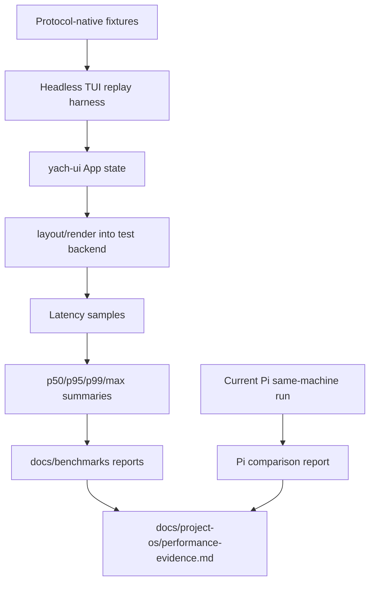

# feat: Build performance evidence harness

## Overview

Build the first real performance-evidence harness for yach’s PRD SLOs. The goal is not to optimize yet; it is to make user-perceived latency and scalability measurable with repeatable workloads, credible reports, and clear limitations.

This plan turns the placeholder in `docs/benchmarks/README.md` into executable benchmark scaffolding and initial measurements for the M2 TUI dogfood loop: startup-to-interactive, idle and active-stream keypress-to-paint, heavy tool output, large paste correctness, huge transcript viewport behavior, and at least one same-machine Pi comparison.

---

## Problem Frame

Performance is a primary reason yach exists. The current evidence only shows that protocol parsing, serialization, dispatch, and transcript append internals are fast. It does not prove the Rust TUI feels faster, handles large sessions better, or beats Pi on an important tail-latency workload.

PRD §10-11 makes performance evidence a product requirement, not a stretch goal. Architecture invariant I6 also gates the Rust-shell thesis on tail latency evidence. The next performance work should therefore start by making measurements reliable and explicit, even if the first results reveal failures or bottlenecks.

---

## Requirements Trace

- R1. Measure startup to interactive prompt after backend-ready against the PRD `<250 ms` target.
- R2. Measure p95 keypress-to-paint while idle against the PRD `<16 ms` target.
- R3. Measure p95 keypress-to-paint during active stream replay against the PRD `<32 ms` target.
- R4. Measure p99 keypress-to-paint or render tail latency under heavy tool output against the PRD `<50 ms` target.
- R5. Characterize large paste handling for zero corruption and zero accidental submit.
- R6. Characterize huge transcript scroll/resize behavior and explicitly identify whether full-buffer render behavior remains.
- R7. Produce at least one same-machine comparison against current Pi before using performance as a product claim.
- R8. Record evidence in the repo-first evidence system: detailed reports in `docs/benchmarks/`, summarized claims in `docs/project-os/performance-evidence.md`.
- R9. Preserve architecture invariant I1/I2: TUI benchmark fixtures should use `yach-proto`/`yach-ui` seams, not Pi RPC details inside `yach-ui`.
- R10. Avoid optimization-before-measurement; initial failures are valid evidence.

---

## Scope Boundaries

- This plan does not promise to meet every SLO; it creates the harness and first credible evidence.
- This plan does not implement transcript virtualization, bounded backend queues, or render-loop restructuring unless a minimal extraction is required for measurement.
- This plan does not start native backend work.
- This plan does not claim same-machine Pi parity unless the comparison workload is actually measured and documented.

### Deferred to Follow-Up Work

- Performance optimizations discovered by the harness: follow-up implementation plans once bottlenecks are known.
- Full Pi comparison matrix across every workload: start with at least one strongest workload, expand later.
- Rich UI / SDK-sidecar performance benchmarks: defer until those surfaces exist.

---

## Context & Research

### Relevant Code and Patterns

- `crates/yach-bench/benches/protocol.rs`, `crates/yach-bench/benches/serialize.rs`, `crates/yach-bench/benches/transcript.rs` use Criterion benchmark groups and deterministic fixtures.
- `crates/yach-bench/Cargo.toml` already depends on `criterion`, `yach-proto`, `yach-ui`, and `yach-adapter-pi-rpc`.
- `crates/yach-ui/src/app.rs` owns event handling, backend event handling, mode transitions, and the TUI render loop.
- `crates/yach-ui/src/layout.rs` composes transcript/tool/input/status widgets and can anchor headless render benchmarks.
- `crates/yach-ui/src/transcript.rs` currently renders by building wrapped lines for all entries before taking the visible viewport; huge transcript benchmarks should characterize this honestly.
- `crates/yach-ui/src/perf_metrics.rs` tracks recent render durations and averages, but not p95/p99 or event-to-paint latency.
- `crates/yach-cli/src/main.rs` has established CLI smoke command patterns with enum-based results and explicit render lines.
- `docs/benchmarks/README.md` defines report names and minimum report contents.
- `docs/project-os/performance-evidence.md` is the canonical evidence index.

### Institutional Learnings

- No `docs/solutions/` directory exists yet.
- Project OS convention: detailed reports live under `docs/benchmarks/`; trackers index summarized evidence with links.
- Existing benchmark baseline should not be re-proven; it already shows protocol internals are unlikely bottlenecks.

### External References

- No external research is needed for this first plan. The repo already has Criterion patterns, a benchmark crate, and clear PRD SLOs. External docs may be useful during implementation if ratatui headless rendering APIs or Criterion customization details become unclear.

---

## Key Technical Decisions

- Build measurement scaffolding before optimization: this prevents speculative performance work and keeps evidence credible.
- Keep synthetic TUI workloads protocol-native: fixtures should use `yach-proto::BackendEvent`, `ServerEvent`, `ClientEvent`, and `yach-ui` app/render surfaces.
- Separate deterministic headless benchmarks from live terminal and Pi comparison evidence: Criterion/headless runs are useful for repeatability but are proxy evidence; PRD-facing user-perceived claims need live timing boundaries or explicit limitations.
- Report percentiles outside the `/perf` overlay first: evidence needs p50/p95/p99/max/sample count; the overlay can remain lightweight until measured needs are clear.
- Treat huge transcript results as characterization: if current full-buffer render behavior fails the PRD expectation, record it as a baseline and plan optimization separately.
- Add methodology gates before evidence claims: reports must state sample count, warmup policy, timing boundaries, workload scale tier, measurement class, and unsupported percentile claims when sample counts are too small.

---

## Output Structure

    crates/yach-bench/
      src/
        lib.rs                  # benchmark helper library exports
        latency.rs              # sample summaries and percentile helpers
        fixtures.rs             # deterministic protocol/TUI workload fixtures
        replay.rs               # headless replay harness helpers
      benches/
        tui_latency.rs          # idle/active/heavy-output/paste/viewport workloads
        startup.rs              # backend-ready to first interactive frame workload
        pi_comparison.rs        # optional same-machine comparison harness, if suitable
    docs/benchmarks/
      startup-YYYY-MM-DD.md
      keypress-YYYY-MM-DD.md
      replay-YYYY-MM-DD.md
      pi-comparison-YYYY-MM-DD.md

The exact file split may change during implementation if Rust visibility or Criterion ergonomics suggest a cleaner shape. The important boundary is that reusable benchmark-only utilities are exported from the `yach-bench` library target for `benches/` crates to import, while production UI code exposes only the minimal testable seams required for measurement.

---

## High-Level Technical Design

> *This illustrates the intended approach and is directional guidance for review, not implementation specification. The implementing agent should treat it as context, not code to reproduce.*

Measurement classes:

| Class | Purpose | Expected home | Evidence claim level |
|---|---|---|---|
| Headless deterministic replay | Repeatable app/event/render-buffer measurements | `crates/yach-bench` Criterion benches/helpers | Component/proxy evidence only; cannot close user-perceived PRD SLOs by itself. |
| Live terminal measurement | Keypress/event to completed terminal draw/flush where feasible | Narrow CLI/PTY harness or documented manual harness | Candidate PRD-facing user-perceived latency evidence. |
| Startup harness | Backend-ready to first usable input frame | `crates/yach-bench` or narrow CLI harness if live terminal/process timing is needed | PRD-facing only if timing boundaries are explicit. |
| Same-machine Pi comparison | Product-level comparison evidence | `docs/benchmarks/pi-comparison-YYYY-MM-DD.md` plus supporting harness code | Product-claim evidence only if workload/timing equivalence is documented. |

Reports must classify each result as `headless proxy`, `live terminal`, `same-machine Pi comparison`, or `unsupported/no-data` so component benchmarks do not get laundered into user-perceived latency claims.

### Methodology gates

Before a report can support a PRD-facing latency claim, it must include:

- Measurement class: `headless proxy`, `live terminal`, `same-machine Pi comparison`, or `unsupported/no-data`.
- Timing boundaries: exactly what starts and stops the timer.
- Sample count and whether p95/p99 are statistically meaningful for that sample count.
- Warmup/cooldown policy and whether samples are independent interactions or tight-loop iterations.
- Workload scale tier and fixture sizes.
- Excluded phases, such as process launch, auth/model setup, terminal emulator behavior, or backend queueing when not measured.

Suggested initial scale tiers:

| Workload | Small | Medium | Large | Huge / stress |
|---|---:|---:|---:|---:|
| Transcript entries | 100 | 1,000 | 10,000 | 50,000+ |
| Tool output | 10 KB | 100 KB | 1 MB | 10 MB+ |
| Paste payload | 1 KB | 10 KB | 100 KB | 1 MB+ |
| Stream deltas | 100 | 1,000 | 10,000 | arrival-rate/backlog stress |

Implementation may adjust these tiers if real dogfood sessions suggest better thresholds, but reports must name the actual measured sizes.

---

## Implementation Units

- U1. **Add benchmark latency summaries**

**Goal:** Provide reusable sample collection and percentile summary utilities for benchmark reports.

**Requirements:** R2, R3, R4, R8

**Dependencies:** None

**Files:**
- Create: `crates/yach-bench/src/latency.rs`
- Create: `crates/yach-bench/src/lib.rs`
- Test: `crates/yach-bench/src/latency.rs`

**Approach:**
- Add a small benchmark-only summary type that records sample count, p50, p95, p99, max, and optional labels.
- Keep this in `yach-bench` initially so production `PerfMetrics` does not grow a reporting API before it is needed.
- Use deterministic percentile behavior for small sample sets and document how empty sample sets are represented.

**Execution note:** Implement test-first because percentile edge cases are easy to get subtly wrong.

**Patterns to follow:**
- Workspace lint style in `Cargo.toml`.
- Existing no-unwrap/no-panic patterns in crate tests.

**Test scenarios:**
- Happy path: samples `[1ms, 2ms, 3ms, 4ms, 5ms]` produce count 5, max 5ms, and monotonic percentile summaries.
- Edge case: one sample produces identical p50/p95/p99/max.
- Edge case: no samples returns an explicit empty/no-data summary without panicking.
- Edge case: unsorted samples produce the same summary as sorted samples.

**Verification:**
- Benchmark utilities can summarize latency samples without violating workspace lints.

---

- U2. **Add deterministic workload fixtures**

**Goal:** Create reusable fixtures for TUI latency workloads using yach protocol and UI types.

**Requirements:** R3, R4, R5, R6, R9

**Dependencies:** U1

**Files:**
- Create: `crates/yach-bench/src/fixtures.rs`
- Modify: `crates/yach-bench/src/lib.rs`
- Test: `crates/yach-bench/src/fixtures.rs`

**Approach:**
- Add fixtures for:
  - small/medium/huge transcript entries
  - high-rate prompt deltas
  - heavy tool call start/finish/result events
  - large paste payloads with multiline, slash-prefixed, and Unicode content
  - representative backend state/model/session events
- Prefer `yach-proto` event structs and `yach-ui::Transcript` setup over raw Pi RPC JSON.
- Keep fixture sizes named and stable so benchmark reports can cite them clearly.

**Patterns to follow:**
- Existing `crates/yach-bench/benches/transcript.rs` fixture loops and deterministic naming.
- `docs/benchmarks/README.md` workload names.

**Test scenarios:**
- Happy path: huge transcript fixture contains the configured number of user/assistant/tool entries.
- Happy path: active stream fixture produces ordered `PromptDelta` events for one session.
- Happy path: heavy tool fixture includes tool start and finish events with large output.
- Edge case: large paste fixture includes newline, leading slash, and multibyte Unicode text.
- Integration expectation deferred to U3: fixture event types should be protocol-native and ready for the replay seam, but U2 does not require direct `App` access yet.

**Verification:**
- Fixtures are deterministic and can be reused by multiple benchmark files.

---

- U3. **Expose a headless TUI replay seam**

**Goal:** Make the TUI event/render loop measurable without requiring a real terminal for every workload.

**Requirements:** R2, R3, R4, R5, R6, R9

**Dependencies:** U1, U2

**Files:**
- Create: `crates/yach-bench/src/replay.rs`
- Modify: `crates/yach-bench/Cargo.toml`
- Modify: `crates/yach-bench/src/lib.rs`
- Modify: `crates/yach-ui/src/app.rs`
- Modify: `crates/yach-ui/src/layout.rs`
- Test: `crates/yach-bench/src/replay.rs`
- Test: `crates/yach-ui/src/app.rs`

**Approach:**
- Expose only the minimum app/render helpers needed to drive synthetic backend/key events and render into a headless ratatui buffer.
- Prefer `pub(crate)`, feature-gated, or benchmark-only adapter seams where possible; any newly public `yach-ui` API must be explicitly documented as experimental/not-stable and reviewed as architecture surface.
- Add direct `crates/yach-bench` dependencies for any APIs used directly by replay code, such as ratatui test/headless rendering, crossterm key types, or Tokio channels; do not rely on transitive dependencies from `yach-ui`.
- Measure event handling plus render-buffer completion for headless workloads, but label these as component/proxy latency rather than real terminal paint.
- Keep production behavior unchanged; benchmark seams should reuse existing `App` state transitions and `layout::render` composition.
- Preserve architecture boundaries: no Pi RPC imports in `yach-ui`.

**Technical design:**

> Directional guidance only: the replay harness should model a sequence like `apply event -> render -> record elapsed`, where events are yach protocol/backend events or crossterm key codes, and rendering targets a headless backend/test buffer.

**Patterns to follow:**
- Existing `run_tui` loop in `crates/yach-ui/src/app.rs` for event ordering.
- Existing `layout::RenderParams` snapshot pattern.
- Existing app unit tests that drive `App::handle_key` and `App::handle_server_event`.

**Test scenarios:**
- Happy path: a simple keypress updates prompt state and one replay render records one latency sample.
- Happy path: a backend prompt delta updates transcript and render completes without requiring a terminal.
- Edge case: empty transcript and empty input render successfully.
- Edge case: large transcript fixture can be rendered headlessly without panicking or corrupting scroll state.
- Integration: replay helper uses `ServerEvent`/`BackendEvent` types and does not depend on Pi RPC JSON.
- Integration: fixture event types from U2 can be fed through the replay seam into app state and a render buffer.

**Verification:**
- A headless replay can drive app state and render deterministically enough for Criterion-style workloads.

---

- U4. **Add core TUI latency benchmarks**

**Goal:** Cover the main PRD dogfood latency workloads with repeatable benchmark targets.

**Requirements:** R2, R3, R4, R5, R6, R8

**Dependencies:** U1, U2, U3

**Files:**
- Create: `crates/yach-bench/benches/tui_latency.rs`
- Modify: `crates/yach-bench/Cargo.toml`
- Test: `crates/yach-bench/benches/tui_latency.rs`

**Approach:**
- Add benchmark groups for:
  - `keypress/idle_keypress_to_paint_headless`
  - `keypress/active_stream_replay_headless`
  - `replay/heavy_tool_output_tail_headless`
  - `paste/large_multiline_component`
  - `viewport/huge_transcript_scroll_headless`
  - `viewport/huge_transcript_resize_headless`
- Add at least one active-stream stress variant that models arrival rate/backlog rather than only a perfectly sequential replay. If queue depth is not observable yet, record that limitation explicitly.
- For paste, record correctness checks as part of the harness in addition to timing, and distinguish component paste correctness from future live-terminal/bracketed-paste evidence.
- For huge transcript, report current behavior honestly. If it scales with full transcript size, the benchmark should make that visible rather than hiding it.

**Patterns to follow:**
- Criterion bench files in `crates/yach-bench/benches/`.
- Existing benchmark names in `docs/benchmarks/baseline-2026-04-23.md`.

**Test scenarios:**
- Happy path: idle keypress fixture records non-empty latency samples and preserves prompt text.
- Happy path: active stream fixture records input latency while transcript deltas are applied.
- Happy path: heavy tool output fixture records latency with tool start/finish events present.
- Edge case: slash-prefixed paste remains prompt input and does not execute `/clear`, `/exit`, or other commands.
- Edge case: multiline paste preserves newline characters and does not submit unless the harness explicitly sends Enter.
- Integration: huge transcript scroll benchmark exercises `Transcript`, `App` scroll state, and `layout::render` together.

**Verification:**
- Running the benchmark suite produces repeatable workload names that map directly to PRD SLO rows.

---

- U5. **Add startup and Pi comparison measurement paths**

**Goal:** Capture the two measurement classes that are not pure headless TUI replay: backend-ready-to-interactive and same-machine Pi comparison.

**Requirements:** R1, R7, R8, R10

**Dependencies:** U1, U2, U3

**Files:**
- Create: `crates/yach-bench/benches/startup.rs`
- Create: `crates/yach-bench/benches/pi_comparison.rs` *(only if Criterion is suitable for the first comparison)*
- Modify: `crates/yach-bench/Cargo.toml`
- Modify: `crates/yach-cli/src/main.rs` *(only if a narrow live measurement command is needed)*
- Test: `crates/yach-cli/src/main.rs` *(only if CLI command is added)*

**Approach:**
- Define the startup timing contract before measuring:
  - `t0_backend_ready`: immediately after injecting or receiving `BackendEvent::Connected` / backend-ready state for the measured path.
  - `t1_interactive`: immediately after the first successful render following ready where a synthetic keypress can mutate prompt state and be rendered.
  - Reports must list excluded phases, such as Pi process launch or auth/model setup, when they are outside the measured interval.
- Separate startup phases in the report:
  - backend/process startup if measured
  - backend-ready to first usable input frame, which is the PRD SLO
- For same-machine Pi comparison, first define a comparison protocol: equivalent payload/session dimensions, terminal size/environment, timing boundaries, instrumentation asymmetries, and allowed claim wording.
- Runtime dependencies for Pi comparison must be explicit: `pi --mode rpc` available on PATH, usable Pi auth/model configuration, and recorded Pi version/package source.
- For same-machine Pi comparison, start with one strongest workload rather than a broad matrix. Candidate first comparisons:
  - active stream keypress-to-paint
  - heavy tool output tail latency
  - long transcript scroll/render cost
- If equivalent Pi instrumentation is not possible, publish a methodology/blocked report and do not count it as comparison evidence.
- Add CLI command only if live timing cannot be represented cleanly in `yach-bench`.

**Patterns to follow:**
- `crates/yach-cli/src/main.rs` smoke command/result pattern if a command is needed.
- `docs/benchmarks/README.md` report requirements for comparison targets and limitations.

**Test scenarios:**
- Happy path: startup harness records backend-ready and first-interactive timestamps in the expected order.
- Error path: missing Pi executable or failed spawn produces a no-data/failed outcome rather than panicking.
- Integration: same-machine comparison report/harness records yach and Pi workload metadata separately.
- Edge case: if Pi comparison cannot produce equivalent samples, the report marks the claim unsupported.

**Verification:**
- At least one startup measurement path exists with explicit timing boundaries.
- At least one Pi comparison methodology exists; actual comparison evidence is not complete until a same-machine Pi measurement is recorded.

---

- U6. **Publish first performance evidence report**

**Goal:** Turn benchmark outputs into repo-first evidence without overstating claims.

**Requirements:** R1, R2, R3, R4, R5, R6, R7, R8, R10

**Dependencies:** U4, U5

**Files:**
- Create: `docs/benchmarks/keypress-YYYY-MM-DD.md` or `docs/benchmarks/replay-YYYY-MM-DD.md`
- Create: `docs/benchmarks/startup-YYYY-MM-DD.md` when startup is measured
- Create: `docs/benchmarks/pi-comparison-YYYY-MM-DD.md` when comparison is measured
- Modify: `docs/project-os/performance-evidence.md`
- Modify: `docs/project-os/next-work.md`
- Modify: `docs/status/m2-tui-checkpoint.md` *(only if M2 caveats change)*

**Approach:**
- Produce one or more detailed benchmark reports with date, commit, machine/environment, command/harness, build/profile mode, workload scale tier, sample count, warmup policy, timing boundaries, p50/p95/p99/max where supported, measurement class, supported claim, confidence/limitations, and follow-up.
- Use `unsupported/no-data` instead of numeric p95/p99 claims when sample counts or methodology do not support tail percentiles.
- Update `performance-evidence.md` only for measured claims, preserving the distinction between headless proxy evidence and PRD-facing live/user-perceived evidence.
- If a workload fails an SLO or exposes noncompliance, mark the evidence as such and create the follow-up optimization target.

**Patterns to follow:**
- `docs/benchmarks/baseline-2026-04-23.md` report style.
- `docs/project-os/templates/performance-evidence-template.md`.

**Test scenarios:**
- Test expectation: none for docs-only report updates; correctness is review-based against the report checklist.

**Verification:**
- Evidence tracker links detailed reports and PRD SLO rows no longer say `unknown` where actual measurements exist.

---

## Success Metrics

- A contributor can run the new benchmark workloads and map outputs back to PRD SLO rows with measurement class labels.
- At least one report includes p50/p95/p99/max, sample count, timing boundaries, and workload scale for a TUI latency workload.
- Any PRD-facing user-perceived claim is backed by live terminal or equivalent end-to-end evidence, not headless proxy evidence alone.
- Large paste correctness is characterized with explicit no-corruption/no-submit assertions, with component vs live-terminal evidence separated.
- Huge transcript behavior is characterized honestly, including whether current rendering is full-buffer.
- A same-machine Pi comparison methodology is documented; actual product-claim evidence remains incomplete until a Pi comparison is measured with equivalent workload/timing boundaries.

---

## System-Wide Impact

- **Interaction graph:** Benchmark-only helpers should drive `yach-ui` through app/event/render seams; production runtime behavior should not change except for minimal visibility/testability extractions.
- **Error propagation:** Harness failures should produce no-data/failed outcomes or benchmark/report limitations, not panics.
- **State lifecycle risks:** Synthetic streams and paste events must not accidentally submit prompts or mutate global state outside the benchmark process.
- **API surface parity:** If app/render helpers become public, they should be narrowly named and documented as test/benchmark seams, not a stable external API promise.
- **Integration coverage:** Headless render benchmarks prove deterministic TUI costs; live terminal/Pi comparison still needs separate evidence.
- **Unchanged invariants:** `yach-ui` must remain Pi-RPC-agnostic; Pi-specific comparison code belongs in `yach-bench`, `yach-cli`, adapters, or reports.

---

## Risks & Dependencies

| Risk | Mitigation |
|------|------------|
| Criterion microbenchmarks do not represent real terminal latency | Split deterministic headless benchmarks from live terminal/startup/Pi comparison reports and label limitations. |
| Initial huge transcript benchmark reveals current full-buffer rendering violates PRD direction | Treat as valuable baseline evidence and plan optimization separately. |
| Benchmark seams accidentally widen production API | Prefer private/feature-gated/benchmark-only seams; document any public `yach-ui` API as experimental and non-stable. |
| Same-machine Pi comparison is not apples-to-apples | Define equivalence protocol before measuring and mark unsupported when timing/payload boundaries diverge. |
| Percentile summaries are misleading for small sample sizes | Require sample counts, warmup policy, and unsupported/no-data markings for weak percentile claims. |
| Synthetic active-stream replay hides queue/backlog contention | Include at least one arrival-rate/backlog stress workload or explicitly mark queue behavior unmeasured. |
| Component paste tests miss real terminal paste behavior | Separate component correctness from live terminal/bracketed-paste evidence. |
| Strict workspace lints slow benchmark scaffolding | Follow existing no-unwrap/no-panic/no-print patterns from tests and CLI output helpers. |

---

## Documentation / Operational Notes

- Detailed reports belong under `docs/benchmarks/` with date-prefixed names.
- `docs/project-os/performance-evidence.md` should remain an index of measured claims, not a raw benchmark dump.
- `docs/project-os/next-work.md` should be updated when P6 moves from planning to measured evidence or when follow-up optimization work becomes the committed priority.
- If benchmark results imply architecture work such as bounded queues or virtualization, create a separate implementation plan rather than mixing optimization into the evidence harness plan.

---

## Open Questions

### Resolved During Planning

- Should P6 start by optimizing? No. The plan starts with measurement scaffolding and baseline characterization.
- Should benchmark fixtures use Pi RPC JSON directly? No. TUI workloads should use yach protocol/UI seams to preserve architecture invariants; Pi-specific code is limited to adapter/comparison surfaces.
- Should same-machine Pi comparison cover all workloads immediately? No. Start with at least one important tail-latency workload and expand after methodology is proven.

### Deferred to Implementation

- Which ratatui headless backend or buffer API is the cleanest for replay rendering: decide while implementing U3.
- Whether startup/Pi comparison belongs entirely in `yach-bench` or needs a narrow `yach-cli` measurement command: decide after prototyping U5.
- Final fixture sizes for each scale tier: start from the tier table in this plan, adjust only if real dogfood sessions justify it, record exact sizes in reports, and keep stable thereafter.
- Whether `PerfMetrics` should gain percentile support for `/perf`: defer until benchmark-side summaries prove what production users need.

---

## Sources & References

- `PRD-v0.1.md`
- `docs/project-os/performance-evidence.md`
- `docs/benchmarks/README.md`
- `docs/benchmarks/baseline-2026-04-23.md`
- `docs/status/m2-tui-checkpoint.md`
- `docs/project-os/architecture-invariants.md`
- `crates/yach-bench/benches/protocol.rs`
- `crates/yach-bench/benches/serialize.rs`
- `crates/yach-bench/benches/transcript.rs`
- `crates/yach-ui/src/app.rs`
- `crates/yach-ui/src/layout.rs`
- `crates/yach-ui/src/transcript.rs`
- `crates/yach-ui/src/perf_metrics.rs`
