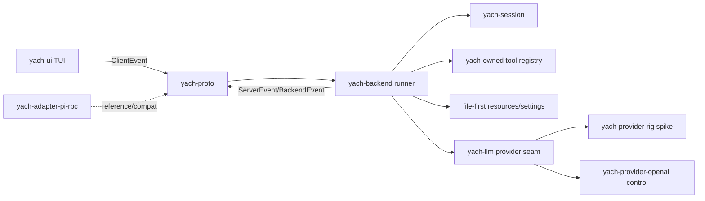

# feat: Plan native Rust backend path

## Overview

Yach should begin native Rust backend work without turning the stock Pi RPC adapter into a feature-complete reimplementation target. This plan defines the architecture path for a native backend that preserves Pi's minimal, file-first, hackable spirit while avoiding unnecessary provider-integration churn through a replaceable provider seam. Rig, Siumai, direct SDKs, and raw HTTP are candidates below that seam, not sources of truth for yach sessions, tools, resources, or UI-facing protocol events.

---

## Problem Frame

The current TUI already talks through `yach-proto` and a channel-based backend bridge. The active backend is `crates/yach-adapter-pi-rpc`, launched by `crates/yach-cli/src/main.rs`, with Pi-specific session discovery also embedded in the CLI. Recent compatibility work proved enough session/model/fork/message surfaces to inform native design. Owner direction now is to stop chasing every Pi-backend parity detail and start planning the durable native backend.

The key tension is provider work: yach should not own avoidable provider API churn, especially while trying to hit the ground running, but should also not adopt a high-level agent framework that hides sessions, prompt assembly, tool execution, resource loading, or transcript semantics. The design should keep yach minimal and inspectable while preferring an existing Rust LLM/provider crate below a replaceable seam. If long-term evidence shows yach needs to own a provider integration directly, that direct path can become another provider adapter rather than a rewrite of the backend architecture.

---

## Requirements Trace

**Protocol and UI boundary**

- R1. Preserve `yach-proto` as the UI/backend seam; the TUI must not import provider, Pi RPC, or native backend internals.

**Pi compatibility policy**

- R2. Treat the Pi RPC backend as a compatibility/reference adapter, not the durable feature-complete backend target.

**Native ownership boundaries**

- R3. Define yach-owned native session, provider, tool, resource, and runtime boundaries before implementation.
- R5. Preserve Pi's minimal design spirit: file-first resources, inspectable state, small primitives, and low-friction customization.

**Provider abstraction**

- R4. Prefer offloading provider integration to an existing Rust crate where it preserves event fidelity; Rig or another library may implement the provider seam but must not own yach sessions, tools, resources, or protocol events.

**Runtime / performance discipline**

- R6. Support future performance evidence and backpressure requirements instead of relying on unbounded streams indefinitely.

**Delivery milestone**

- R7. Identify the first implementable native backend milestone that can dogfood through the existing TUI.

---

## Scope Boundaries

- This plan does not implement the native backend.
- This plan does not select Rig permanently; it defines a spike/evaluation path.
- This plan does not attempt exhaustive Pi backend parity for compaction, retry, dynamic commands, or resource loading before native work.
- This plan does not introduce provider-hosted sessions as canonical yach state.
- This plan does not design rich UI/plugin surfaces beyond the seams needed to avoid blocking native backend work.
- This plan does not stabilize public native-backend crate APIs before one fixture-backed provider stream, one provider error, one cancellation path, and one persisted session append have exercised them.

### Deferred to Follow-Up Work

- Full native compaction/retry/steering semantics: define after native session/event store shape is established.
- Rich browsable session tree UI: implement after native session records and branch semantics are owned by yach.
- Full provider matrix: start with spikes and one minimal dogfood path before expanding.
- Pi session/resource migration tooling: plan after native file formats are sketched.

---

## Context & Research

### Relevant Code and Patterns

- `crates/yach-proto/src/lib.rs` owns typed `ClientEvent`, `ServerEvent`, `BackendEvent`, `Handshake`, capabilities, session message/stat types, and model metadata. New cross-boundary backend behavior should extend this crate first.
- `crates/yach-ui/src/app.rs` is already backend-agnostic through `mpsc` channels carrying `ClientEvent` and `BackendEvent`.
- `crates/yach-cli/src/main.rs` is the current orchestration bottleneck: it spawns Pi RPC, bridges reader/writer loops, and performs Pi-specific recent-session scanning.
- `crates/yach-adapter-pi-rpc/src/{serialize.rs,parse.rs,session.rs}` show the current adapter boundary: capabilities, outbound serialization, inbound parsing, and process IO are separated.
- `crates/yach-adapter-pi-sdk/src/lib.rs` is a rich-UI sidecar stub, not a native backend foundation.
- `crates/yach-bench` and `docs/project-os/performance-evidence.md` show the project pattern of measurement-first performance claims.
- `Cargo.toml` enforces strict workspace Clippy lints, including no `unwrap`, no `expect`, no `panic`, no `todo`, no stdout/stderr printing, and no holding locks across await.

### Institutional Learnings

- `docs/project-os/decisions.md` records `D20260427-01`: stop chasing exhaustive Pi-backend parity before native backend work.
- `docs/project-os/architecture-invariants.md` requires `yach-proto` as the seam, intentional process boundaries, file-first resources, measured compatibility, and performance evidence.
- `docs/project-os/next-work.md` promotes P9: plan native Rust backend path.
- `docs/protocol/yach-proto-v0.md` lists current protocol omissions: explicit abort, error envelopes, stream completion/failure, protocol-level session tree records, resource/package discovery, dynamic commands, and compaction/retry/follow-up controls.

### External References

- Rig docs/site: provider clients, integrations, tools, and agent abstractions — https://rig.rs/ and https://docs.rig.rs/
- Rig crate docs — https://docs.rs/rig-core/latest/rig/
- Siumai crate docs as a lower-agent-gravity unified LLM interface — https://docs.rs/siumai/latest/siumai/
- GenAI crate docs as a lightweight adapter alternative — https://docs.rs/genai/latest/genai/
- async-openai crate docs; note Assistants/Threads/Runs deprecations and Responses API support — https://docs.rs/async-openai/latest/async_openai/
- OpenAI Responses migration and Assistants sunset guidance — https://developers.openai.com/api/docs/guides/migrate-to-responses/
- Anthropic Messages API — https://docs.anthropic.com/en/api/messages
- Gemini API deprecations/function-calling/migration docs — https://ai.google.dev/gemini-api/docs/deprecations, https://ai.google.dev/gemini-api/docs/function-calling, https://ai.google.dev/gemini-api/docs/migrate

---

## Why Native Backend Planning Now

The original PRD framed native backend work as gated by Phase 1 validation. That validation is not fully complete: same-machine Pi comparison evidence remains imperfect, resource compatibility is still incomplete, and the Pi-backed shell is still the near-term dogfood path. The reason to plan native work now is narrower: recent M2/M3 work has validated the critical architectural seam (`yach-proto` + TUI channel bridge) enough to start low-commitment native seams and provider-evaluation spikes without chasing exhaustive Pi backend parity.

Native implementation beyond seams/spikes should pause if it stops producing evidence for one of these outcomes:

- the TUI can dogfood a real developer workflow more reliably or responsively than the Pi-backed path;
- yach-owned sessions/resources/tools are easier to inspect, modify, and reason about than provider/Pi-owned equivalents;
- provider abstraction work demonstrably reduces churn without hiding yach semantics;
- the native runner validates cancellation, error, persistence, and file-first behavior, not just happy-path chat streaming.

The first native dogfood milestone is therefore a learning milestone, not a declaration that the native runtime has replaced the Pi compatibility backend.

---

## Key Technical Decisions

- Yach owns sessions, transcripts, tool lifecycle, resources, permissions, and UI-facing protocol events. Provider frameworks are implementation details below a yach-owned provider seam.
- Add a small native backend runtime boundary before adding provider libraries. This prevents Rig/Siumai/direct SDK types from leaking into `yach-ui` or canonical session state.
- Prefer a provider-library adapter first, with Rig as the leading candidate unless the spike shows unacceptable event-fidelity, security, dependency, or abstraction-leakage problems. Direct OpenAI/Anthropic/Gemini implementations remain escape-hatch adapters, not the default path.
- Prefer transport-family/provider-capability modeling over one-off vendor-specific core types. Provider-specific options should live in an extension map or adapter-specific config, not pollute the common protocol.
- Keep Pi RPC compatibility as reference behavior and migration input. Do not implement more Pi adapter features unless they unblock dogfooding or native design.
- Treat OpenAI Assistants/Threads/Runs as a non-goal because they are deprecated and conflict with yach-owned sessions. OpenAI Responses is the relevant direct OpenAI endpoint.
- Bounded queues/backpressure and cancellation should be designed into native runtime seams early, even if the first prototype still uses existing unbounded UI channels.
- Provider-side conversation/response IDs are not canonical yach sessions, but the provider-library spike must test whether the library exposes enough control over them for multi-turn continuity, tool continuation, retry, cache behavior, or cost/latency.
- The native dogfood runner must include one minimal file-first behavior, such as inspectable session-event persistence or file-based provider/profile config, so the first milestone does not collapse into a chat-only runtime.

---

## Open Questions

### Resolved During Planning

- Should Rig be the native backend framework? No. Rig may be a provider adapter implementation detail, but yach should own the backend runtime and session/tool/resource semantics.
- Should yach keep pursuing exhaustive Pi-backend parity first? No. The Pi adapter is now a compatibility/reference layer per `D20260427-01`.
- Should yach use provider-hosted sessions as canonical state? No. Provider conversation/thread IDs may be cached as optimization metadata only.

### Deferred to Implementation

- Exact crate names and split: this plan suggests names, but implementation may adjust based on dependency boundaries and compile times.
- Exact provider trait method signatures: decide while implementing the first spike and golden scenarios.
- Whether Rig, Siumai, GenAI, or direct SDKs provide sufficient event fidelity: prove with adapter spikes.
- Final native session file format: needs a focused session-store design pass once backend crate boundaries land.
- Precise backpressure strategy between native provider streams and current UI channels: design after the backend runner seam is extracted.

---

## Output Structure

Expected first-pass crate/module shape. This tree is directional; implementation may split or rename crates if dependency boundaries become clearer.

```text
crates/
  yach-backend/
    src/lib.rs                  # backend runner trait, bridge handle, runtime events
  yach-session/
    src/lib.rs                  # native session/event records and tree/fork model skeleton
  yach-llm/
    src/lib.rs                  # optional split once provider request/event/error traits have concrete consumers
  yach-provider-rig/
    src/lib.rs                  # optional Rig spike adapter behind the yach-owned provider seam
  yach-provider-openai/
    src/lib.rs                  # direct OpenAI Responses comparison adapter spike
```

---

## High-Level Technical Design

> *This illustrates the intended approach and is directional guidance for review, not implementation specification. The implementing agent should treat it as context, not code to reproduce.*



Provider libraries only translate request/response shapes. They do not own canonical sessions, tool execution, resource loading, or UI event semantics.

---

## Runner Selection and Native Dogfood UX Contract

The first native backend path should be explicit and reversible.

- Default launch remains Pi RPC-backed.
- Native dogfood entry should be an explicit CLI selection such as `yach tui --backend native` or equivalent, not an implicit auto-switch.
- Accepted backend values should be small and visible: `pi`, `native`, and optionally `auto` later.
- No in-session backend switching in the first milestone.
- The TUI status/footer or help/debug surface should show the active backend, e.g. `backend: native dogfood` or `backend: pi rpc`.
- Native dogfood mode should announce limitations on launch: prompts/streaming plus the specific minimal file-first behavior are available; tools, resource packages, Pi session import, and rich fork/tree navigation may be unavailable until later phases.
- Unsupported native actions should return clear text status, not silent no-ops. Example: `Tools are not available in native dogfood mode yet.`
- Native startup failure should exit or fall back according to the selected mode with readable terminal text; an explicit `native` selection should not silently fall back to Pi unless the user requested `auto`.

---

## Native Runtime Event and Queue Policy

Before the native dogfood runner is considered complete, the backend runner seam needs a minimal event-flow contract:

- Every active turn has a yach turn/request id that is carried by stream events and persisted session records.
- Stream lifecycle is explicit: started, delta, completed, failed, cancelled, and stale/ignored late event.
- Tool-call and completion/failure/cancellation events must never be dropped.
- Text deltas may be coalesced within a bounded internal queue when the consumer is slow; raw debug payloads may be dropped or sampled before user-visible events are dropped.
- A full internal queue must either await with cancellation support or fail the stream with a structured backpressure error; the policy must be tested, not left implicit.
- Closed UI/backend receivers cancel the active provider stream and mark any persisted turn as cancelled or failed rather than complete.
- Empty provider streams emit an explicit completion or failure state.

The existing unbounded outer UI channel may remain temporarily, but native work should not claim backpressure is solved until the UI boundary is either included in the policy or explicitly exempted with evidence.

---

## Native Security and Trust Boundaries

Native backend work introduces provider credentials, model-generated tool requests, file-first resource reads, local session persistence, raw debug payloads, and third-party provider libraries. These are not optional polish; they are part of the backend architecture.

Minimum controls before provider or tool dogfooding:

- **Credentials:** define accepted sources (environment, OS keychain, config file, or CLI injection), forbid hardcoded/committed secrets, redact credentials in logs/debug/session files, and document rotation/reload behavior.
- **Tool calls:** treat model tool calls as untrusted input; schema-validate arguments; require user approval or configured policy for dangerous tools; constrain filesystem/network access where possible; size-limit and redact tool results before provider submission.
- **Resources/settings:** define approved resource roots; canonicalize paths; address symlink/path traversal; distinguish trusted project files, user config, generated state, and provider-visible context; require policy before sending local file contents to providers.
- **Raw debug data:** capture raw provider payloads only in explicit debug mode or behind a clear setting; redact authorization headers and obvious secret patterns; define retention/deletion for raw payloads.
- **Provider extension maps:** adapter-owned allowlists should validate keys/types/ranges and prevent arbitrary credentials or policy bypasses from flowing through generic extension metadata.
- **Session persistence:** classify transcripts, tool results, provider metadata, and debug payloads as sensitive local data; choose file permissions and retention/deletion behavior accordingly.
- **Third-party libraries:** review transitive dependencies/default features during spikes, disable unnecessary features, enforce timeouts/retry limits, and treat malformed provider/library output as untrusted.

---

## Native Dogfood Success Criteria

The first native dogfood path should validate seam assumptions, not merely prove that text can stream. It is successful when a developer can run a constrained native mode through the existing TUI and observe:

- explicit native backend selection and active-backend status;
- one real prompt stream through the TUI;
- one structured provider error surfaced with actionable user-facing copy;
- one cancellation or simulated dropped-stream path that returns the UI to idle without stale events corrupting the next turn;
- one inspectable file-first artifact, preferably an append-only native session event log for the prompt/assistant exchange or a file-based provider/profile config;
- one persisted session append/reload or documented reason why persistence is intentionally deferred no further than the next unit;
- no provider framework types in `yach-ui`, `yach-proto`, or canonical session records.

---

## Provider Seam Acceptance Criteria

A provider adapter is acceptable only if it can satisfy these criteria behind yach-owned types:

| Criterion | Required behavior |
|---|---|
| Session ownership | Yach-owned sessions are canonical, but spikes must test whether provider IDs are semantically required for continuation, retry, cache behavior, or cost/latency before classifying them as optimization metadata. |
| P0 dogfood streaming | Preserve model id, text deltas, completion/failure, cancellation, and basic normalized errors. |
| P1 tool fidelity | Preserve tool-call boundaries, provider call ids, arguments, results, usage, and finish reasons when tool paths enter scope. |
| P2 capability discovery | Multimodal, structured output, reasoning/thinking, local/offline support, and parallel tools are aspirational until multiple providers prove the abstraction holds. |
| Tool ownership | Yach owns tool definitions, permissions, execution, and results; adapter renders schemas and parses calls. |
| Error taxonomy | Start with auth, rate limit/quota, invalid request, context length, unavailable model, timeout/network, provider internal, and malformed stream; expand only when provider fixtures justify it. |
| Escape hatch | Provider-specific options can pass through only through adapter-owned allowlists and validation. |
| Replaceability | Replacing Rig with Siumai/direct SDKs changes provider adapter crates, not session/runtime/protocol code. |
| Semantic portability | Backend/runtime logic may not depend on provider-specific extension keys except behind capability-gated adapter methods. |

---

## User-Visible Error / Status Mapping

The exact copy can evolve, but U6 should map backend/provider errors to consistent UI locations and recovery actions.

| Error category | User-visible location | Suggested copy | Recovery action |
|---|---|---|---|
| Auth failure | Blocking status or startup error | `Authentication failed for {provider}.` | Show setup hint; do not retry automatically. |
| Rate limit/quota | Transcript/status error | `Provider limit reached. Try later or switch model.` | Keep input available; optional retry. |
| Context length | Transcript/status error near prompt | `Prompt exceeds the model context window.` | Suggest shorten/fork/future compact. |
| Unavailable model | Model selector/status | `Selected model is unavailable.` | Prompt model switch. |
| Timeout/network | Stream failure status | `Connection interrupted.` | Return to idle; allow retry. |
| Safety/refusal | Assistant content or explicit refusal status | Decide per provider fixture; do not collapse all refusals into transport errors. |
| Malformed stream | Error status plus debug pointer | `Provider returned an unreadable stream.` | Return to idle; preserve redacted debug payload if enabled. |
| Backpressure/slow consumer | Status/error event | `Native backend fell behind this stream.` | Fail or cancel according to queue policy. |

Non-blocking provider errors should keep prompt focus stable. Blocking startup errors should be readable as plain terminal text. Status cannot rely on color alone and should degrade in narrow terminals.

---

## Implementation Units

- U1. **Define minimal backend runner crate and provisional module boundaries**

**Goal:** Add only the crate structure needed to extract the backend runner seam while keeping session/provider boundaries provisional until evidence exercises them.

**Requirements:** R1, R2, R3, R5

**Dependencies:** None

**Files:**
- Modify: `Cargo.toml`
- Create: `crates/yach-backend/Cargo.toml`
- Create: `crates/yach-backend/src/lib.rs`
- Test: colocated tests in `crates/yach-backend/src/lib.rs`

**Approach:**
- Add `crates/yach-backend` with workspace lints enabled.
- Keep `session` and `llm` as provisional modules or design notes until U3/U4 provide concrete flows that justify independent crates.
- Do not add marker-only crates or Rig/provider SDK dependencies in this unit.
- A later unit may split `yach-session` or `yach-llm` into crates once each has concrete types used by the next implementation step.

**Patterns to follow:**
- `crates/yach-adapter-pi-rpc/src/lib.rs` for small crate exports.
- `crates/yach-adapter-pi-sdk/src/lib.rs` for minimal capability-oriented crate scaffolding.
- Workspace lint configuration in `Cargo.toml`.

**Test scenarios:**
- Happy path: constructing each crate's initial capability/metadata type succeeds and implements expected equality/debug behavior.
- Integration: workspace builds with the new crates included and strict lints inherited.

**Verification:**
- The new backend crate compiles as a workspace member with no UI dependency on native backend internals.

---

- U2. **Extract a backend runner seam from CLI Pi orchestration**

**Goal:** Make `crates/yach-cli/src/main.rs` capable of launching different backend runners without hardcoding all logic into `run_tui_command()`.

**Requirements:** R1, R2, R3, R7

**Dependencies:** U1

**Files:**
- Modify: `crates/yach-cli/src/main.rs`
- Modify: `crates/yach-cli/Cargo.toml`
- Modify: `crates/yach-backend/src/lib.rs`
- Test: `crates/yach-cli/src/main.rs`
- Test: `crates/yach-backend/src/lib.rs`

**Approach:**
- Introduce a yach-owned backend runner/handle concept that exposes the same channel shape the TUI already uses: outbound `ClientEvent`, inbound `BackendEvent`.
- Move Pi-specific runner setup behind a Pi runner implementation while leaving Pi parser/serializer/session code in `crates/yach-adapter-pi-rpc`.
- Keep Pi recent-session discovery explicitly marked as compatibility/reference behavior until native session storage exists.

**Patterns to follow:**
- Existing `bridge_reader_loop` and `bridge_writer_loop` in `crates/yach-cli/src/main.rs`.
- Existing `run_tui(client_tx, backend_rx)` seam in `crates/yach-ui/src/lib.rs` and `crates/yach-ui/src/app.rs`.

**Test scenarios:**
- Happy path: a fake backend runner sends `BackendEvent::Connected` and can receive a `ClientEvent` from the UI-facing channel.
- Error path: backend runner startup failure returns a structured CLI command result instead of panicking or printing directly.
- Integration: Pi runner still emits the same initial handshake/capability behavior as before after extraction.

**Verification:**
- TUI launch behavior remains Pi-backed by default, but runner selection is no longer structurally hardwired to Pi RPC in one monolithic function.

---

- U3. **Design minimal native session/event skeleton for dogfood**

**Goal:** Establish yach-owned session primitives for the first native dogfood path while preserving room for later tree, fork, branch, compaction, and import semantics.

**Requirements:** R2, R3, R5, R7

**Dependencies:** U1

**Files:**
- Modify: `crates/yach-backend/src/lib.rs` or create `crates/yach-session/src/lib.rs` only if the boundary is justified by concrete use
- Modify: `docs/protocol/yach-proto-v0.md`
- Test: `crates/yach-backend/src/lib.rs` or `crates/yach-session/src/lib.rs`

**Approach:**
- Define dogfood-minimum native concepts: session id, entry id, turn id, role/content, linear ordering or parent id, provider metadata needed by U6, and versioned event records.
- Choose an append-only log vs snapshot/event-hybrid direction before dogfooding; do not fully finalize the file format, but require an inspectable on-disk representation for basic prompt-stream sessions.
- Define how partial streams, failed streams, cancellation, retry attempts, and empty completions are recorded.
- Keep branch/tree/import/compaction as explicit design constraints, not first-pass implementation requirements.
- Model compaction as a future explicit native event, not a Pi-message heuristic.

**Patterns to follow:**
- Existing `SessionMessage`, `SessionStats`, `ForkMessage`, and `RecentSession` in `crates/yach-proto/src/lib.rs`.
- Current TUI branch summary in `crates/yach-ui/src/session_tree.rs` as a display consumer, not canonical state.

**Test scenarios:**
- Happy path: a linear user/assistant exchange produces stable entry ids and parent links.
- Happy path: a linear user/assistant exchange produces an append-only persisted event sequence that can be reloaded.
- Edge case: empty session has zero messages and no current turn.
- Edge case: cancelled or failed assistant stream is recorded distinctly from a completed turn.
- Edge case: provider ids are stored as provider metadata only when the provider spike proves they are needed.

**Verification:**
- Native session types can represent the first dogfood prompt stream on disk, reload it, and leave clear extension points for future tree/fork/import semantics without Pi-specific fields.

---

- U4. **Define dogfood-minimum provider request/event/error seam**

**Goal:** Create the smallest yach-owned provider seam needed to compare provider libraries and drive the first native dogfood runner without leaking framework types upward.

**Requirements:** R3, R4, R5, R6

**Dependencies:** U1

**Files:**
- Modify: `crates/yach-backend/src/lib.rs` or create `crates/yach-llm/src/lib.rs` only if a concrete adapter consumer justifies the crate split
- Test: `crates/yach-backend/src/lib.rs` or `crates/yach-llm/src/lib.rs`

**Approach:**
- Define P0 dogfood types first: model reference, request messages, text stream delta, completion/failure/cancellation, basic usage when available, raw debug payload metadata, and normalized provider error envelope.
- Define P1 tool-call stream types only as needed for U5 fixtures; do not require full tool execution in U6.
- Defer broad capability matrix fields such as multimodal, structured output, reasoning/thinking, local/offline, and parallel tools until multiple provider fixtures prove the shape.
- Include provider-specific extension metadata behind adapter-owned allowlists and validation.
- Avoid references to Rig, Siumai, OpenAI, Anthropic, Gemini, or Pi types in the public seam.
- Design stream events so they can map to `ServerEvent::PromptDelta`, future stream completion/failure, and later `ToolCallStarted`/`ToolCallFinished`.

**Patterns to follow:**
- `crates/yach-proto/src/lib.rs` for typed events, serde-friendly structs, and protocol tests.
- Existing `ModelInfo` and `ToolResult` protocol types as UI-facing downstream shapes.

**Test scenarios:**
- Happy path: a plain text stream event sequence can be converted into UI-facing prompt deltas by a backend runner.
- Happy path: a tool-call fixture can preserve call id, name, argument payload, result, and finish status without requiring real tool execution.
- Error path: representative provider errors map into normalized yach error categories while preserving redacted raw details for explicit debug mode.
- Edge case: provider-specific options can be present only through adapter-owned allowlists without changing the common request shape.

**Verification:**
- The provider seam has no dependency on provider libraries and can be implemented by multiple adapter crates or modules.

---

- U5. **Spike provider-library integration behind the seam**

**Goal:** Validate that an existing Rust LLM/provider crate can carry most provider integration work while yach keeps ownership of sessions, tools, resources, and protocol events.

**Requirements:** R4, R5, R6, R7

**Dependencies:** U4

**Files:**
- Create: `crates/yach-provider-rig/Cargo.toml` if a crate boundary is justified, otherwise use a provisional module
- Create: `crates/yach-provider-rig/src/lib.rs` if a crate boundary is justified, otherwise use a provisional module
- Create: `crates/yach-provider-openai/Cargo.toml` if a direct adapter crate is justified, otherwise use fixtures/control module
- Create: `crates/yach-provider-openai/src/lib.rs` if a direct adapter crate is justified, otherwise use fixtures/control module
- Modify: `Cargo.toml` only when new crates are actually created
- Test: provider spike module or crate tests
- Create: `docs/spikes/2026-04-27-rig-provider-evaluation.md`

**Approach:**
- Implement only enough adapter code to run golden scenarios against mock streams or recorded fixtures first.
- Start with Rig as the preferred candidate unless early inspection shows it cannot stay below the seam; compare its output against direct OpenAI Responses fixtures plus at least one contrasting Anthropic Messages or Gemini function-calling fixture.
- Treat direct provider fixtures as fidelity checks and future escape hatches, not as the preferred implementation route.
- Test whether provider response/conversation IDs affect multi-turn context, tool continuation, retry, cache behavior, latency, or cost; persist them as metadata only when justified.
- Consider Siumai or GenAI if Rig's higher-level agent abstractions are too difficult to keep below the seam.
- Pin dependency versions during the spike, review transitive dependencies/default features, and document startup/binary-size concerns if observed.

**Execution note:** Characterization-first: write golden scenario fixtures before deciding whether a provider adapter is acceptable.

**Patterns to follow:**
- Existing adapter parse/serialize tests in `crates/yach-adapter-pi-rpc/src/{parse.rs,serialize.rs}`.
- Existing benchmark fixture style in `crates/yach-bench/src/fixtures.rs`.

**Test scenarios:**
- Happy path: plain streaming text becomes yach stream events with ordered deltas.
- Happy path: streamed tool-call arguments preserve provider call id and JSON arguments.
- Happy path: parallel tool-call fixture preserves distinct call ids and ordering metadata where available.
- Happy path: multi-turn fixture identifies whether provider-side ids are semantically required or optional metadata.
- Error path: rate-limit, invalid request, auth failure, context-length, safety/refusal, and malformed stream fixtures map to normalized errors.
- Edge case: unknown provider event payload is preserved only as redacted debug/raw metadata rather than crashing.

**Verification:**
- The spike doc recommends keep/drop/limit for Rig, or another provider crate if Rig fails, based on adapter thinness, event fidelity, semantic portability, security/trust impact, dependency cost, and lock-in risk. Direct provider ownership should be recommended only if existing crates cannot preserve the required semantics.

---

- U6. **Build the first native backend dogfood runner**

**Goal:** Add a minimal native backend runner that can drive the existing TUI through `yach-proto` without Pi RPC for a constrained path.

**Requirements:** R1, R3, R5, R6, R7

**Dependencies:** U2, U3, U4, and selected result from U5

**Files:**
- Modify: `crates/yach-backend/src/lib.rs`
- Modify: `crates/yach-cli/src/main.rs`
- Modify: `crates/yach-proto/src/lib.rs` if needed for explicit stream completion/error events
- Modify: `docs/protocol/yach-proto-v0.md`
- Test: `crates/yach-backend/src/lib.rs`
- Test: `crates/yach-cli/src/main.rs`
- Test: `crates/yach-proto/src/lib.rs`

**Approach:**
- Start with explicit CLI selection for native backend dogfooding, leaving Pi RPC as default until native is usable.
- Support initialize, active-backend status, model list/state, prompt submission, streaming deltas, simple session append/reload, and structured completion/error state.
- Include one minimal file-first behavior: an inspectable native session event log or file-based provider/profile config.
- Use bounded internal queues according to the native runtime queue policy even if the outer UI channel remains unchanged initially.
- Add turn/request ids so cancellation and stale queued events are deterministic.
- Avoid real tool execution in the first dogfood runner unless the provider spike proves it is trivial and event-fidelity-safe; fixture-backed tool-call event mapping is still useful evidence.

**Patterns to follow:**
- `run_tui_command()` launch flow in `crates/yach-cli/src/main.rs` after U2 extraction.
- UI tests around `ServerEvent::PromptDelta`, model selection, and stream state in `crates/yach-ui/src/app.rs`.

**Test scenarios:**
- Happy path: native runner connects, advertises capabilities, and sends ready/state plus active-backend status to the TUI.
- Happy path: prompt submission appends a user entry, persists an inspectable event, streams assistant deltas, completes the turn, and can reload the session event log.
- Edge case: empty or unavailable model list reports a status/error event without disconnecting the UI.
- Edge case: empty/whitespace prompt is rejected before provider call and does not create a native session entry.
- Edge case: `default` session id creates or aliases the first native session, while unknown non-default ids return structured status/error.
- Error path: provider stream failure becomes a structured backend error/status, records a failed/cancelled turn when appropriate, and returns stream state to idle.
- Error path: cancellation/drop of an in-flight stream does not leave stale active tool/session state and ignores late events by turn id.
- Error path: slow consumer/backpressure scenario follows the documented overflow policy.
- Integration: CLI can launch Pi runner and native runner through the same backend-runner seam.

**Verification:**
- A constrained native backend mode can be run through the existing TUI without Pi RPC, without UI imports of backend/provider crates, and with visible limited-mode status plus one inspectable file-first artifact.

---

- U7. **Apply project OS and protocol update gates**

**Goal:** Keep the repo-first planning surfaces aligned with actual architecture/evidence changes without turning routine docs into a broad implementation unit.

**Requirements:** R2, R3, R7

**Dependencies:** U1-U6 as applicable; each document update is triggered only by the relevant unit landing

**Files:**
- Modify: `docs/project-os/next-work.md`
- Modify: `docs/project-os/roadmap.md`
- Modify: `docs/project-os/compatibility.md`
- Modify: `docs/project-os/performance-evidence.md` when measurements are added
- Modify: `docs/project-os/decisions.md` only for new durable decisions
- Modify: `docs/protocol/yach-proto-v0.md`

**Approach:**
- Treat U7 as a release/checkpoint gate rather than a reason to touch every listed document after every unit.
- Update `next-work.md` and `roadmap.md` when this plan is accepted or the next implementation priority changes.
- Update `docs/protocol/yach-proto-v0.md` only when protocol events/types change.
- Update `compatibility.md` when Pi/native behavior or migration/reference status changes.
- Update `performance-evidence.md` only with measurements; do not claim native backend performance based on Rust assumptions.
- Update `decisions.md` only after a new durable decision, especially after U5 provider evaluation.

**Patterns to follow:**
- `docs/project-os/agent-handoff.md` update gate.
- Existing status vocabulary in `docs/project-os/README.md`.

**Test scenarios:**
- Test expectation: none -- documentation/status update only.

**Verification:**
- Project OS surfaces point to this plan and accurately describe the current native backend status without premature performance or compatibility claims.

---

## System-Wide Impact

- **Interaction graph:** TUI remains channel/protocol-driven; CLI becomes runner selector; native backend owns session/runtime/provider orchestration; Pi RPC remains an adapter.
- **Error propagation:** Provider errors should normalize inside the yach-owned provider seam/backend runner, then surface through typed protocol events or status/error envelopes. A future explicit error event is likely needed.
- **State lifecycle risks:** Native sessions must avoid partial writes, duplicate entries on retry, broken parent links on fork, and stale stream events after cancellation.
- **API surface parity:** Pi adapter, native runner, and future SDK sidecar should all map to `yach-proto` rather than bespoke UI interfaces.
- **Integration coverage:** Runner selection, stream events, tool-call mapping, session append, and provider errors need cross-crate tests beyond isolated unit tests.
- **Unchanged invariants:** `yach-ui` must not speak Pi RPC or provider APIs directly. Provider libraries must not own canonical yach sessions or resources.

---

## Risks & Dependencies

| Risk | Mitigation |
|------|------------|
| Rig or another framework pulls yach into its agent/session/tool model | Keep provider libraries below the yach-owned provider seam; compare with direct provider fixtures; reject adapters that leak abstractions upward. |
| Yach ends up owning too much provider churn | Use Rig/Siumai/direct SDKs selectively behind replaceable adapters; split provider seam into P0/P1/P2 rather than modeling every capability up front. |
| Native work bypasses existing protocol seam | Require protocol changes in `crates/yach-proto` before UI-visible behavior crosses boundaries. |
| CLI becomes a second monolith | Extract backend runner seam before adding native implementation. |
| Native session model under-designs resources/forks/compaction | Start with explicit persisted event model and parent/turn ids; defer rich tree/import/compaction behavior but include extension points and importability constraints. |
| Performance claims become speculative | Preserve benchmark/evidence discipline; add measurements before updating performance status. |
| Dependency bloat hurts startup | Measure binary size/startup for provider adapters; keep adapters optional/feature-gated if needed. |
| OpenAI Assistants deprecation trap | Use Responses API for direct OpenAI work; do not model canonical yach state around Assistants/Threads/Runs. |
| Provider credentials leak through logs/session/debug data | Centralize credential loading, redact secrets before persistence/logging, and keep fixtures secret-free. |
| Model-generated tool calls become local execution without policy | Treat tool calls as untrusted, schema-validate arguments, require approval/policy for dangerous tools, and size/redact tool outputs. |

---

## Phased Delivery

### Phase 1 — Minimal runner and provisional seams

- Land U1-U2 plus the dogfood-minimum parts of U3-U4.
- No provider framework dependency yet unless needed for fixture interpretation.
- Outcome: yach has a backend runner seam, provisional session/provider modules, and no marker-only crate sprawl.

### Phase 2 — Provider leverage and portability spike

- Land U5 as soon as the minimal provider event seam exists; it may run in parallel with finalizing U3/U4 details.
- Evaluate Rig first against direct OpenAI Responses fixtures and at least one contrasting Anthropic/Gemini fixture; evaluate Siumai/GenAI if Rig looks too agent-framework-heavy.
- Outcome: evidence-backed provider-library adapter choice and pruned provider seam for first native dogfood path, with direct provider adapters reserved as escape hatches.

### Phase 3 — Minimal native dogfood runner

- Land U6.
- Native runner supports a constrained prompt-streaming path through existing TUI plus visible native-mode status, structured error/cancel handling, and one inspectable file-first artifact.
- Outcome: yach can begin dogfooding without Pi RPC for basic native sessions while validating seam assumptions.

### Phase 4 — Expand native ownership

- Follow-up plans for session persistence, tools, resources/settings/packages, compaction/retry, and migration/import.
- Outcome: native backend becomes the durable product path while Pi RPC remains reference/migration support.

---

## Documentation / Operational Notes

- Update `docs/protocol/yach-proto-v0.md` whenever new stream/error/session events are added.
- Update `docs/project-os/next-work.md` after this plan is accepted and when implementation units land.
- Update `docs/project-os/compatibility.md` to distinguish migration-critical Pi behavior from native-owned behavior.
- Record any durable provider-framework decision in `docs/project-os/decisions.md` after U5, not before.
- Add spike findings to `docs/spikes/` so the choice is auditable.

---

## Sources & References

- Project OS: `docs/project-os/next-work.md`, `docs/project-os/decisions.md`, `docs/project-os/architecture-invariants.md`, `docs/project-os/compatibility.md`, `docs/project-os/performance-evidence.md`
- Protocol note: `docs/protocol/yach-proto-v0.md`
- Product thesis: `PRD-v0.1.md`
- Current protocol: `crates/yach-proto/src/lib.rs`
- Current UI seam: `crates/yach-ui/src/app.rs`, `crates/yach-ui/src/lib.rs`
- Current CLI bridge: `crates/yach-cli/src/main.rs`
- Current Pi adapter: `crates/yach-adapter-pi-rpc/src/parse.rs`, `crates/yach-adapter-pi-rpc/src/serialize.rs`, `crates/yach-adapter-pi-rpc/src/session.rs`
- Rig docs: https://rig.rs/, https://docs.rig.rs/, https://docs.rs/rig-core/latest/rig/
- Siumai docs: https://docs.rs/siumai/latest/siumai/
- GenAI docs: https://docs.rs/genai/latest/genai/
- async-openai docs: https://docs.rs/async-openai/latest/async_openai/
- OpenAI Responses migration: https://developers.openai.com/api/docs/guides/migrate-to-responses/
- Anthropic Messages API: https://docs.anthropic.com/en/api/messages
- Gemini docs: https://ai.google.dev/gemini-api/docs/deprecations, https://ai.google.dev/gemini-api/docs/function-calling, https://ai.google.dev/gemini-api/docs/migrate
